# Platform Super-Admin — User Manual

**Who this is for:** you run the **airin** platform itself. You don't belong to any one
business — you create the businesses (called **tenants**), decide what each one is allowed to use,
set the prices the platform charges them, and keep an eye on the health of everything.

Your workspace is the **Platform Admin** area at `/admin`. Everything in this manual happens there.

> **Important — two different worlds.** The Platform Admin area (`/admin`) is **only** for platform
> super-admins (you). The businesses themselves are run by their owners from a completely separate
> **Dashboard** (`/dashboard`). You create the business here; the owner runs it there. If an owner
> ever says "I can't find the Platform Admin menu", that's expected — they're not supposed to.

---

## Table of contents

1. [Sign in](#1-sign-in)
2. [Get your bearings — the layout](#2-get-your-bearings--the-layout)
3. [The Platform Overview](#3-the-platform-overview)
4. [Create a new business (tenant)](#4-create-a-new-business-tenant)
5. [Open and manage one business](#5-open-and-manage-one-business)
6. [Turn features on and off (modules)](#6-turn-features-on-and-off-modules)
7. [Subscription plans & pricing](#7-subscription-plans--pricing)
8. [Billing & invoices](#8-billing--invoices)
9. [Monitoring & system health](#9-monitoring--system-health)
10. [AI usage & the AI flow catalog](#10-ai-usage--the-ai-flow-catalog)
11. [Support, impersonation & "view as"](#11-support--impersonation)
12. [Announcements, Config & Platform Users](#12-announcements-config--platform-users)
13. [Everyday checklists](#13-everyday-checklists)

---

## 1. Sign in

1. Open the app URL in any browser.
2. On the sign-in screen, either **click the "Super Admin" demo card** (it fills the credentials for
   you) or type your email and password and click **Sign in**.
3. You land on the **Hub**. Click the **Platform Admin** tile to enter `/admin`.

> **Language:** the **EN / ID** toggle (English / Indonesian) is on every screen, including this one.
> Switch any time — it never affects your data.

---

## 2. Get your bearings — the layout

Every Platform Admin page has the same **left sidebar**. It's grouped so related tools sit together:

| Group | Menu items | What they're for |
|-------|-----------|------------------|
| *(top)* | **Hub**, **Overview** | Return to the launcher; the platform dashboard |
| **TENANTS** | **Tenants**, **Support** | Create/manage businesses; help a business in trouble |
| **GROWTH** | **Analytics**, **Billing**, **Subscription Plans**, **AI Usage** | Money & adoption |
| **OPERATIONS** | **Monitoring**, **System Health**, **Agent Flows** | Keep the platform running |
| **PLATFORM** | **Platform Users**, **Announcements**, **Audit Log**, **Platform Config** | Admin accounts, tenant-wide notices, the audit trail, and global settings |

At the **bottom-left** you'll always find your name, the **EN/ID** language toggle, a **Dark mode**
switch, and **Sign out**.

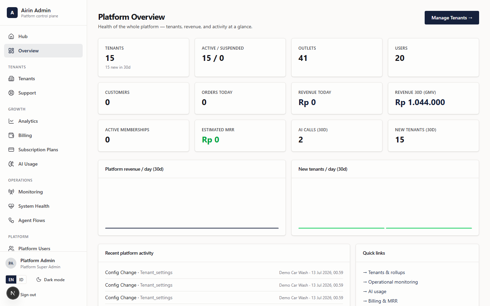

---

## 3. The Platform Overview

**Menu → Overview** (`/admin`). This is your one-glance health check for the whole platform. The
tiles across the top show:

- **Tenants** (total) and **new in 30 days**
- **Active / Suspended** split
- **Outlets** and **Users** across all businesses
- **Customers**, **Orders today**, **Revenue today**, **Revenue 30d (GMV)**
- **Active memberships**, **Estimated MRR** (your recurring subscription revenue — see §8),
  **AI calls (30d)**, **New tenants (30d)**

Below the tiles are two charts (**platform revenue per day** and **new tenants per day**), a
**Recent platform activity** feed (config changes, suspensions, etc.), and **Quick links** into the
deeper pages.

> If any tile shows a soft "requires Platform Super Admin" message, your account isn't a super-admin
> — sign in with a super-admin account.

---

## 4. Create a new business (tenant)

This is the most common thing you'll do. Creating a tenant provisions the whole business and gives
it a permanent **6-character tenant code** (the prefix of every membership number that business will
ever issue — it never changes).

**Step by step:**

1. In the sidebar click **Tenants**. You'll see the list of every business, with search, a status
   filter, and per-row **Edit** / **Suspend** actions.

   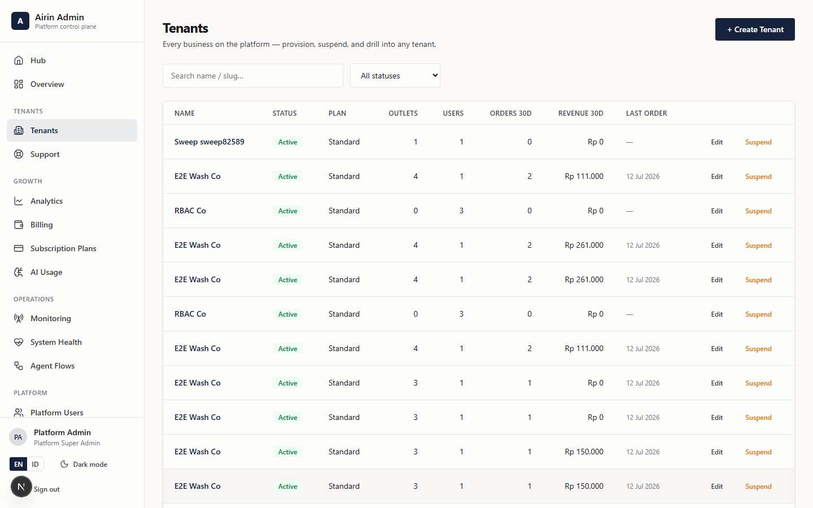

2. Click **+ Create Tenant** (top-right).
3. Fill in the business name (and any other fields the form asks for), and **choose its subscription
   plan** (see §7 to define plans first). Status defaults to **Active**.
4. Save. The business now exists and has its tenant code.
5. Hand the owner their **first-login credentials** so they can sign in to the **Dashboard** and set
   up branding, branches and staff. (What they do next is the
   [Tenant Owner manual](02-tenant-owner-manual.md).)

> **The Create Tenant wizard has four steps:** **Account + owner login** (business name, slug, and the
> owner's name/email/password) → **Modules** (which features the business starts with) → **Legal
> entity** (optional PT) → **Branch** (their first outlet). At the end the business exists, has its
> tenant code, and the owner can sign in immediately.

> **Businesses can also self-register.** If you send someone to `/register`, they create their own
> tenant + owner login and get a tenant code automatically — you don't have to create it by hand.
> You'll still see them appear in the Tenants list.

---

## 5. Open and manage one business

A tenant's actions live on **two pages** — the **list** (`/admin/tenants`) and the **detail page**
(click the business name to open `/admin/tenants/[slug]`).

**On the Tenants list** (per-row or in the create wizard):
- **+ Create Tenant** — the 4-step wizard (see §4).
- **Edit** — change the business **name, slug, or subscription plan**.
- **Suspend** (when active) / **Reactivate** (when suspended).

**On the tenant detail page** you see its **stats** (orders 30d, revenue 30d, active members,
customers), its **branches** and **users**, and can:
- **🔑 Reset owner password** — set a new password and get the owner's email to hand back to them.
- **👤 Impersonate** the owner to troubleshoot (see §11).
- **+ Add branch** for the tenant (useful during onboarding).
- **Toggle feature modules** on/off (see §6).
- **Support notes** — internal notes about this business (pin the important ones). **These are never
  shown to the tenant** — they're your private support memory.

**Suspend vs. delete:** always prefer **Suspend**. Suspending blocks the business but keeps all its
history, and you can **Reactivate** it later in one click. All of these actions — suspend, reactivate,
impersonate, password reset, module changes — are recorded in the **audit log** (who did it, and the
before/after state).

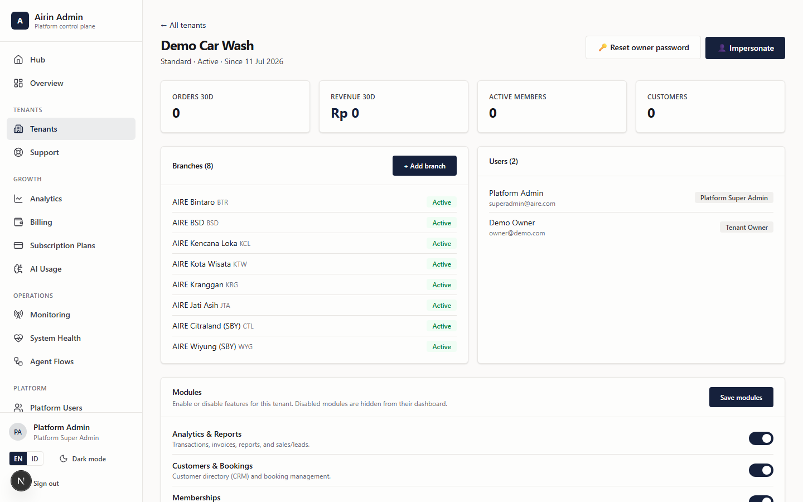

---

## 6. Turn features on and off (modules)

Each business has a set of **feature modules** you can switch on or off. **Everything is ON by
default** — you only turn a module **off** to hide it from that business's dashboard.

**Core areas can never be turned off:** Hub, Overview, Users & Roles, Payment Gateway, and Settings
are always available.

**Toggleable modules:**
Analytics & Reports · Customers & Bookings (CRM) · Memberships · Vouchers · Promotions ·
Catalog & Outlets · Inventory & Procurement · Finance & Settlement · HR & Payroll ·
AI Assistant · WhatsApp AI Agent.

**How to change them:**
1. Open the tenant's **detail page** (§5).
2. Find the **modules** section and flip the toggles.
3. The change is **audited** (before → after) and takes effect the **next time** the owner loads
   their dashboard.

> **Rule of thumb:** the set of modules a business can see should match **what they're paying for**.
> Check this right after onboarding.

---

## 7. Subscription plans & pricing

**Menu → Subscription Plans** (`/admin/plans`). These are the plans **the platform charges the
businesses** — your product's pricing tiers.

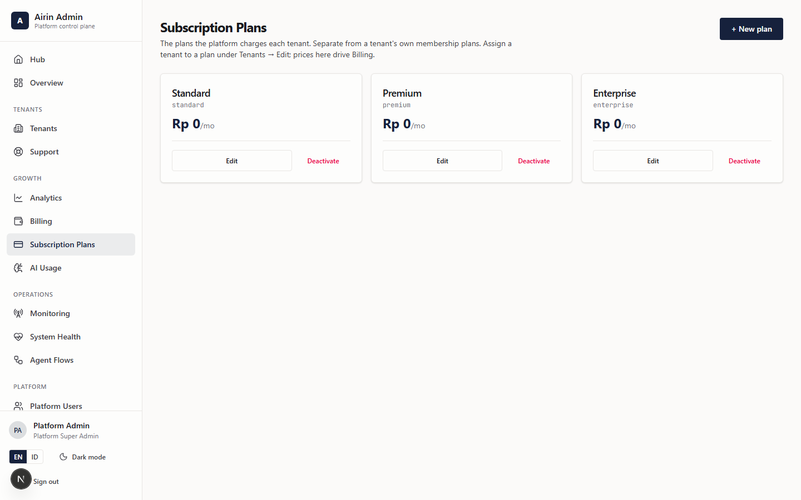

Each plan has:
- a **code** and **name**
- a **price** and **billing cycle** (monthly or annual)
- the **features** it includes
- **limits** (e.g. number of outlets or users)

**To put a business on a plan:** go to **Tenants → Edit** and pick the plan there.

**Deactivating** a plan stops it being offered to new tenants but leaves businesses already on it
untouched.

> **Important — what a plan actually enforces today.** A plan's **price** drives the MRR/billing
> estimate, and its **features / limits** are shown on the plan card as a description of the tier — but
> the system does **not** auto-block a tenant for exceeding a plan limit. The one control that is truly
> enforced is the per-tenant **Modules** toggle set (§6): that's what hides features from a business.
> So when you put a business on a plan, also **set its Modules to match** — the plan is the promise,
> the modules are the switch.

> ⚠️ **Don't confuse two kinds of "plan".**
> - **Subscription plans** (here, `/admin/plans`) = what the *platform* charges *businesses*.
> - **Membership plans** (`/dashboard/memberships`, owner-side) = what a *business* sells to *its
>   customers*. You never touch those.

**Menu → Config** (`/admin/config`) holds platform-wide **default plans** and **feature flags**.

---

## 8. Billing & invoices

**Menu → Billing** (`/admin/billing`). Two tabs.

**Overview tab** — your recurring revenue:
- **Estimated MRR** = (plan price) × (number of active businesses on that plan). Annual plans are
  divided by 12 so everything is expressed as a monthly figure. The same MRR number appears on the
  Overview, and an **Annual run rate** tile shows MRR × 12.
- A **By plan** table breaks it down: price, tenants, active count, and MRR per plan.
- MRR is an **estimate** computed from plan price × active tenants — it's a planning figure, not a
  billed amount.

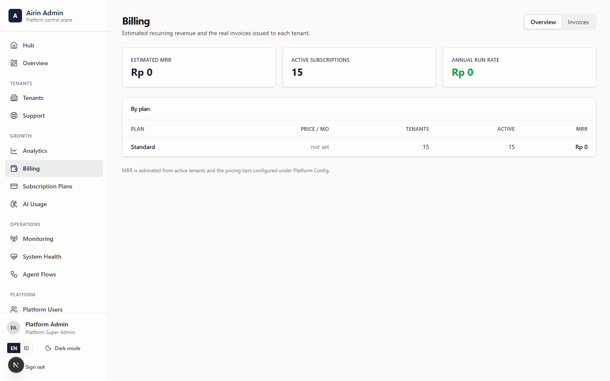

**Invoices tab** — the actual per-tenant invoices:
- Tiles for **Outstanding / Overdue / Paid this month**.
- Enter a **period** (`YYYY-MM`) and click **Generate drafts** to raise an invoice per active tenant.
- Filter by status and, per row, move an invoice along its lifecycle: **Send** a draft → **Mark paid**
  or flag **Overdue** → **Void** if needed. These are real, persisted invoices.

---

## 9. Monitoring & system health

- **Menu → Monitoring** (`/admin/monitoring`) — operational metrics (orders, revenue, customers)
  across all businesses. You can view **globally** or pick a single tenant.

  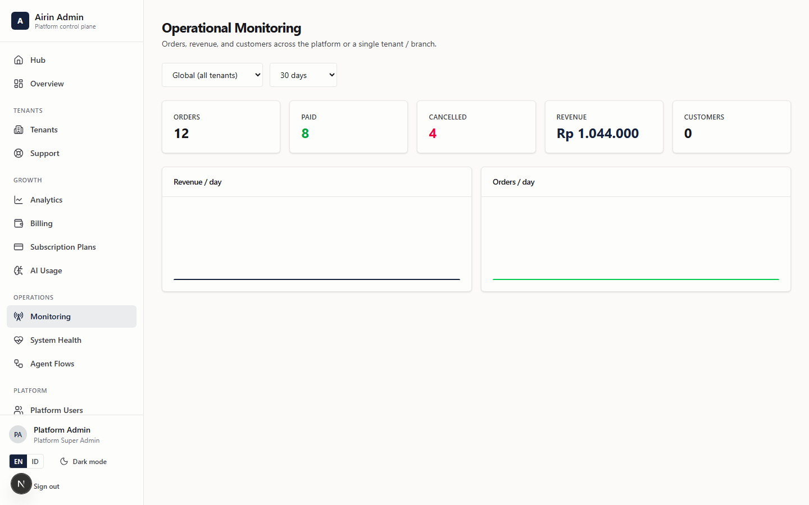

- **Menu → System Health** (`/admin/health`) — the technical heartbeat: database latency, whether the
  WhatsApp gateway (WAHA) is reachable, entity counts, and — when the server exposes it — a **live
  list of running containers** with their state/health and a **per-container log viewer**.

  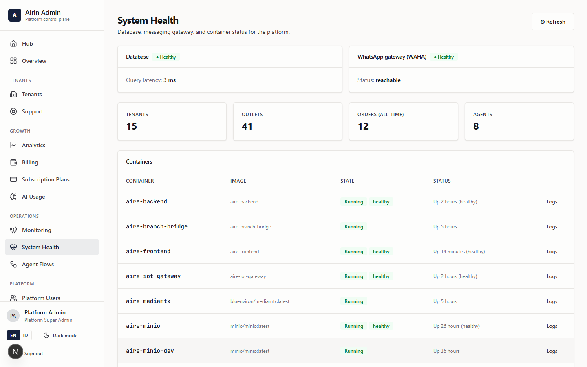

- **Menu → Analytics** (`/admin/analytics`) — platform-wide growth and usage charts.

  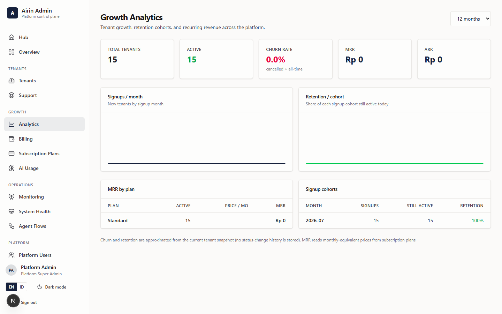

---

## 10. AI usage & the AI flow catalog

- **Menu → AI Usage** (`/admin/ai-usage`) — how much AI is being used: number of calls, errors,
  tokens, and the top tools, globally or per tenant.

  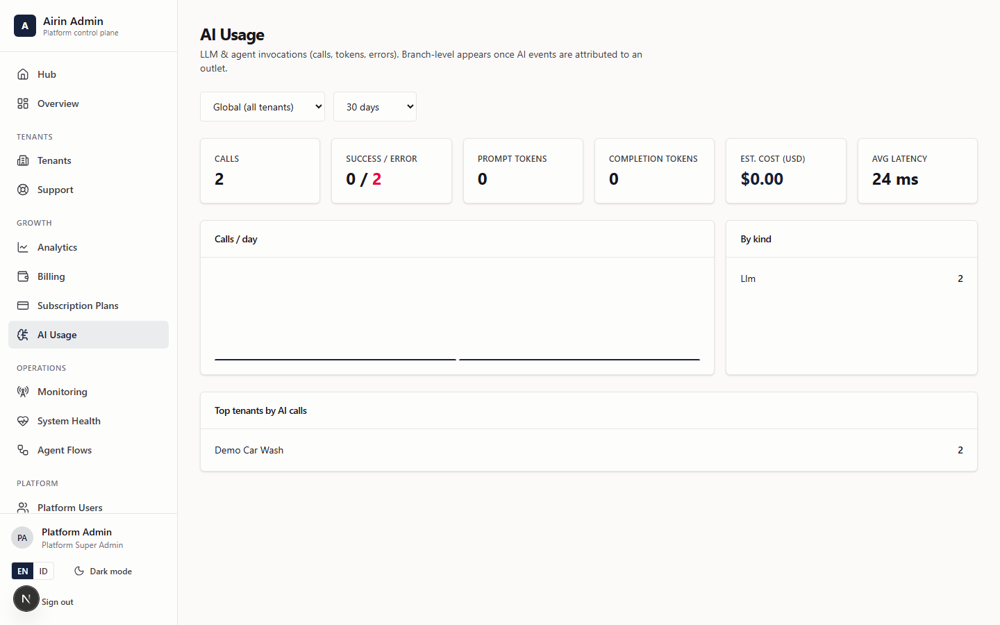

- **Menu → Agent Flows** (`/admin/agent-flows`) — the **catalog of AI flows** you publish for
  businesses to use. You design drag-and-drop flows in the hosted **n8n** builder, then **publish**
  each one here (it gets a webhook URL and a kind — WhatsApp or automation). Businesses then simply
  **select** a published flow for their WhatsApp agent — they never get an n8n login. The technical
  note is [n8n-agent-builder.md](../n8n-agent-builder.md).

  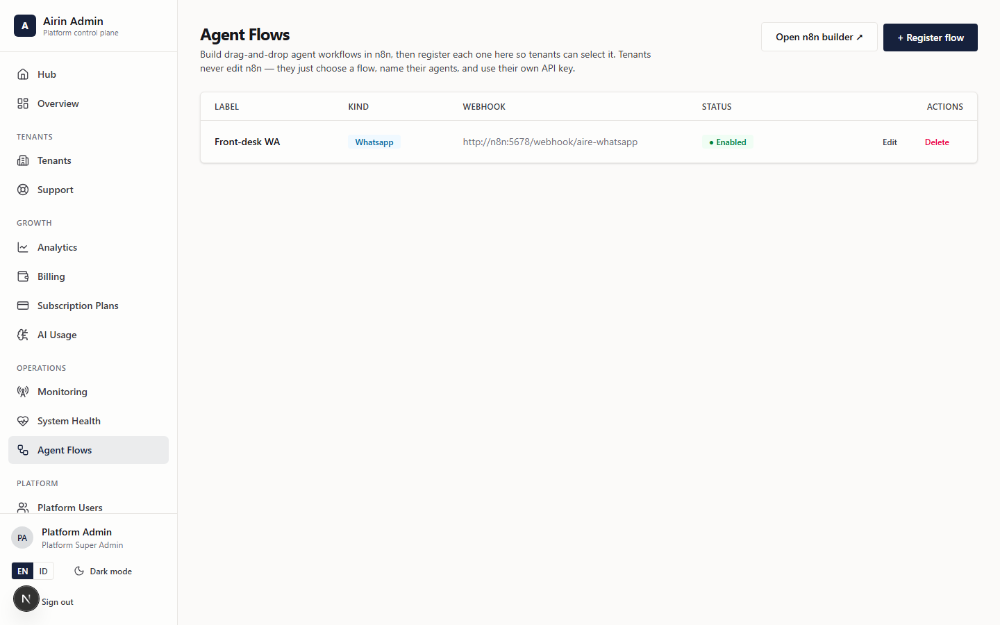

---

## 11. Support & impersonation

**Menu → Support** (`/admin/support`). Search for a business, see a **"needs attention"** list, and
reactivate suspended ones quickly.

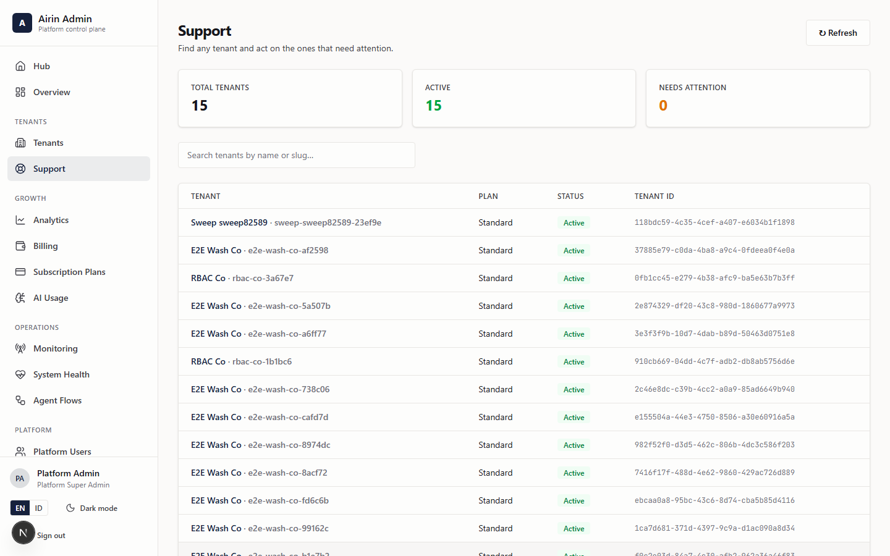

**Impersonation** (from a tenant's detail page, §5) logs you into the owner's Dashboard **as that
owner** so you can reproduce exactly what they see.

- Use it for **support only**, not routine work.
- **Every impersonation is logged** (it's in the audit trail).
- When you're done, click **Stop impersonation** to return to your own admin session.

The **audit log** (`/admin/audit`, and each business has its own) records these sensitive actions.

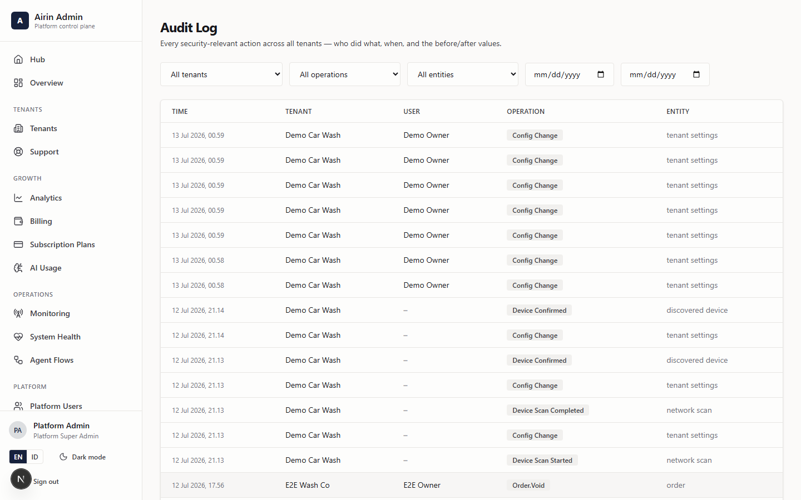

### 11.1 "View as" — preview any tenant's world from the Hub
Beyond raw impersonation, the **Hub** gives super-admins a quick way to *preview* a business exactly as
its own people see it. At the top of the Hub is a **"Viewing tenant"** picker — choose the business you
want to inspect, then use the preview tiles:

- **Owner Dashboard** — opens `/dashboard` as that business's owner.
- **Employee View** — pick one of the tenant's staff (or *"pick one for me"*) and open their
  self-service `/employee` view.
- **Customer / Member Portal** — pick a customer and open their member `/portal`.

While previewing, a floating amber banner — **"👁️ Viewing as … · {business}"** — follows you
everywhere, with an **Exit preview** button to drop straight back to your own admin session. Like
impersonation, every "view as" is **role-gated to super-admins and audited**.

> **Impersonate vs. View as.** *Impersonate* (from a tenant detail page) is the deep, full-session
> route for reproducing a bug. *View as* (from the Hub) is the fast, switch-between route for checking
> what owners / staff / customers of a given tenant actually see — handy for QA and support triage.

---

## 12. Announcements, Config & Platform Users

### 12.1 Announcements — notices to tenants
**Menu → Announcements** (`/admin/announcements`). Broadcast a notice to businesses — a maintenance
window, a new feature, a policy change.

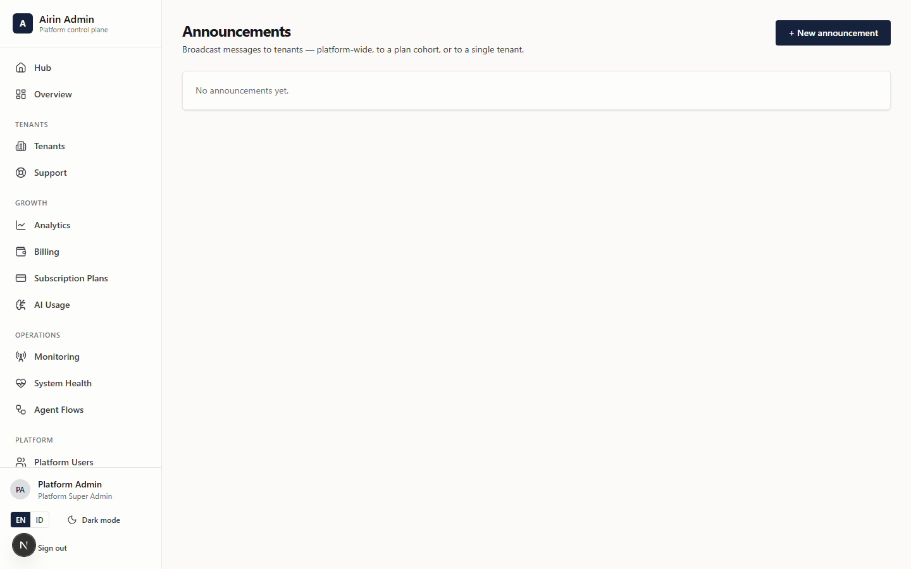

1. Click **+ New announcement**.
2. Enter a **title** and **body**, pick a **severity** (Info / Warning / Critical), and choose the
   **audience**: **All tenants**, **By plan** (a plan cohort), or **One tenant**.
3. Save as a draft, then **Publish** when you're ready (you can **Unpublish**, **Edit** or **Delete**
   later). Only **published** announcements are visible to tenants.

### 12.2 Platform Config — global defaults & feature flags
**Menu → Platform Config** (`/admin/config`). Platform-wide settings that apply across *all* tenants:

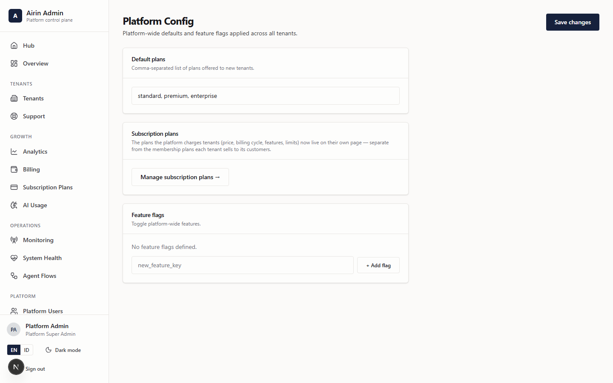

- **Default plans** — the comma-separated list of plans offered to new tenants.
- **Subscription plans** — a shortcut to manage pricing on the **Subscription Plans** page (§7).
- **Feature flags** — global on/off switches (each a key you can toggle, add, or remove). New flags
  start **disabled**.

Click **Save changes** to apply.

### 12.3 Platform Users — other admins
**Menu → Platform Users** (`/admin/users`). The other people who can sign in to Platform Admin. Add or
manage fellow platform operators here. Keep this list tight — everyone here can see and act across
**every** business.

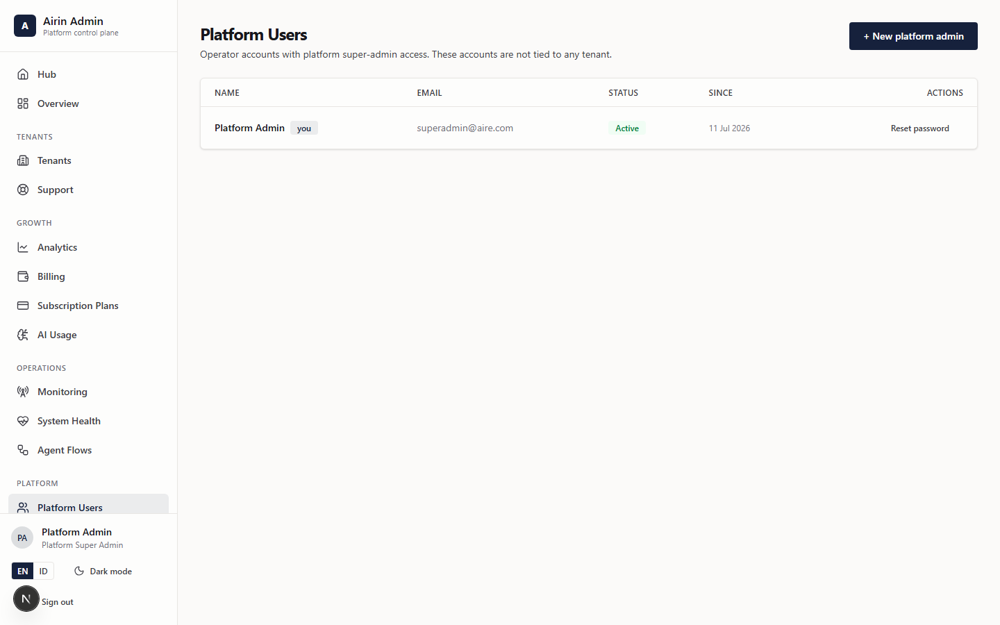

---

## 13. Everyday checklists

**Onboard a new business**
1. **Tenants → + Create Tenant** (or point them at `/register`).
2. Assign the correct **subscription plan**.
3. Open the tenant detail and confirm its **modules** match what they paid for.
4. Give the owner their **first-login credentials** and the
   [Tenant Owner manual](02-tenant-owner-manual.md).

**A business reports a problem**
1. **Support** → search for them.
2. Open the tenant detail → **Impersonate the owner** and reproduce the issue.
3. **Stop impersonation** when done.
4. If needed, check **System Health** and **Monitoring**.

**Weekly platform review**
1. **Overview** — glance at active/suspended, new tenants, MRR.
2. **Billing** — confirm MRR looks right.
3. **System Health** — database + WhatsApp gateway green.
4. **AI Usage** — watch error rates.

> **Golden rules:** prefer **suspend** over delete (reversible, keeps history); use **impersonation**
> sparingly and remember it's logged; keep each business's **modules** aligned with its plan.
