# Tenant Owner / Manager — User Manual

**Who this is for:** you **own or manage one business** on airin. You control **everything inside
your business** — all your outlets (branches), staff, service menu, prices, memberships, vouchers,
promotions, stock, finance, HR, and the AI assistant.

Your workspace is the **Dashboard** (`/dashboard`). This manual walks you through it, in the order
you'll actually use it — **set-up first, then day-to-day, then reporting**.

> **What you'll see may differ slightly.** Your sidebar only shows the **modules** the platform has
> switched on for your business (the default is *everything on*). If something described here isn't
> in your sidebar, that module is off — ask your platform administrator to enable it.

> **You won't use `/admin`.** That "Platform Admin" area belongs to the platform operator, not to
> businesses. You run everything from the **Dashboard**.

---

## Table of contents

1. [Sign in & the Hub](#1-sign-in--the-hub)
2. [Find your way around the Dashboard](#2-find-your-way-around-the-dashboard)
3. [First-time setup (the guided wizard)](#3-first-time-setup-the-guided-wizard)
4. [Setup in detail — do these in order](#4-setup-in-detail--do-these-in-order)
5. [Customers, memberships, bookings & broadcast](#5-customers-memberships--bookings)
6. [Vouchers & promotions](#6-vouchers--promotions)
7. [Inventory, recipes, COGS, finance & tax](#7-inventory-recipes-cogs--finance)
8. [Reporting](#8-reporting)
9. [People — HR, payroll & commission](#9-people--hr--payroll)
10. [AI assistant & WhatsApp](#10-ai-assistant--whatsapp)
11. [Settings & configuration](#11-settings--configuration)
12. [Tips & troubleshooting](#12-tips--troubleshooting)
13. [Glossary](#13-glossary)

---

## 1. Sign in & the Hub

1. Open your business's app URL.
2. Enter your email and password and click **Sign in** (or click the **Tenant Owner** demo card on a
   demo system).
3. You arrive at the **Hub** — a launcher with tiles for **Dashboard**, **Point of Sale**, and
   **Self-Service Kiosk**. Click **Dashboard**.

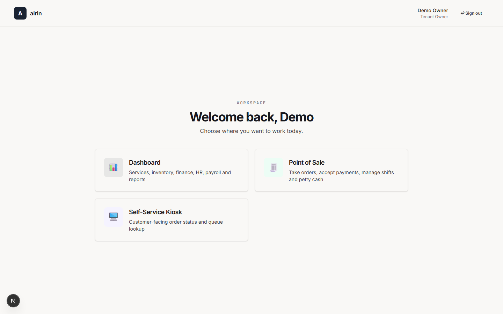

> **Language:** the **EN / ID** toggle (bottom-left of the Dashboard, and on every screen) switches
> English ↔ Indonesian at any time.

---

## 2. Find your way around the Dashboard

The Dashboard has a **left sidebar** grouped into sections. You scroll it to reach everything. The
main groups are:

| Group | What lives there |
|-------|------------------|
| *(top)* | **Hub**, **Overview** |
| **ANALYTICS** | Transactions, Refunds, Invoices, Tax Invoices (e-Faktur), Reports, Sales & Leads, Shifts & Cash |
| **CUSTOMERS** | Customers & CRM, Bookings, Memberships, Vouchers, Feedback & NPS, WA Broadcast |
| **CATALOG / OPERATIONS** | Services, Catalog, Products, Inventory, Procurement, Stock Opname, COGS, Promotions |
| **FINANCE** | Finance, Settlement, Accounting, Commission |
| **PEOPLE** | Users & Roles, HR, Payroll |
| **AI** | AI Assistant, Agent Workflow, Agentic AI / WhatsApp, Conversations, Monitoring |
| **SETTINGS** | Settings, Branches, Payment Methods, Payment Gateway, Barcodes, Designers, Devices, Audit log |

> **Only what you're paying for shows.** The sidebar hides any **module** the platform switched off
> for your business, so your list may be shorter than the table above. A few areas — Hub, Overview,
> Users & Roles, Payment Gateway and Settings — can **never** be switched off. If a whole section is
> missing and you expected it, that's a platform setting, not a bug: ask your platform administrator.

At the **bottom-left**: your name & role, the **EN/ID** toggle, and **Sign out**. The **Overview**
page is your home base:

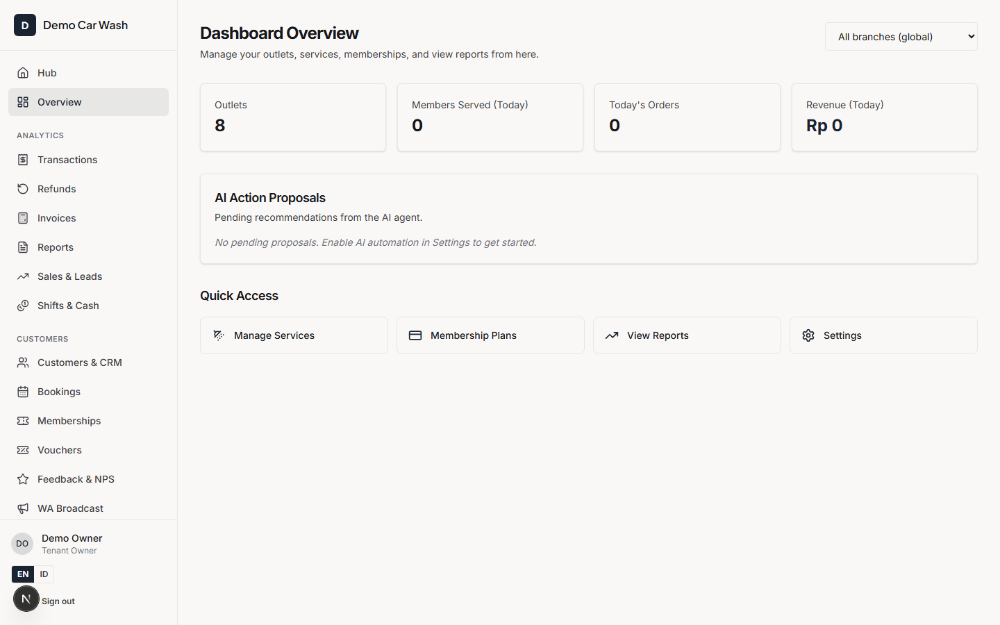

- The **branch selector** (top-right on most pages) lets you view **all branches** together or focus
  on **one outlet**.
- **AI Action Proposals** surfaces recommendations from the AI agent (if you've enabled AI).

---

## 3. First-time setup (the guided wizard)

The fastest way to get a brand-new business ready is the **onboarding wizard**. New owners are
guided into it automatically the first time they sign in; you can also open it any time from
**`/dashboard/onboarding`**. A progress bar across the top tracks the six steps and lets you jump
back to any step you've already passed.

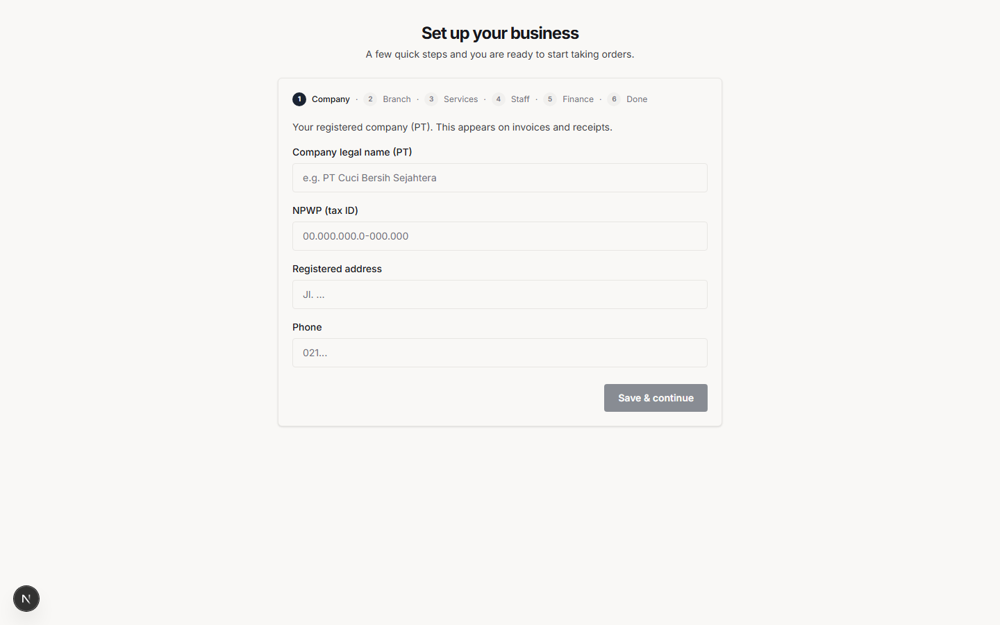

**Company → Branch → Services → Staff → Finance → Done.** Take them in order the first time; each
step's **Save & continue** unlocks the next, and **Back** returns to a finished step to edit it.

**Step 1 · Company.** Your business name and identity — this seeds your branding and the read-only
**tenant code** that prefixes every membership number you'll ever issue.

**Step 2 · Branch.** Your first outlet: branch **name**, a **3-letter branch code** (used on receipts
and membership numbers — choose it carefully, it's awkward to change later), an optional **legal
entity** (PT), **address**, a **WhatsApp phone number**, and your default **service charge %** and
**tax / PPN %**.

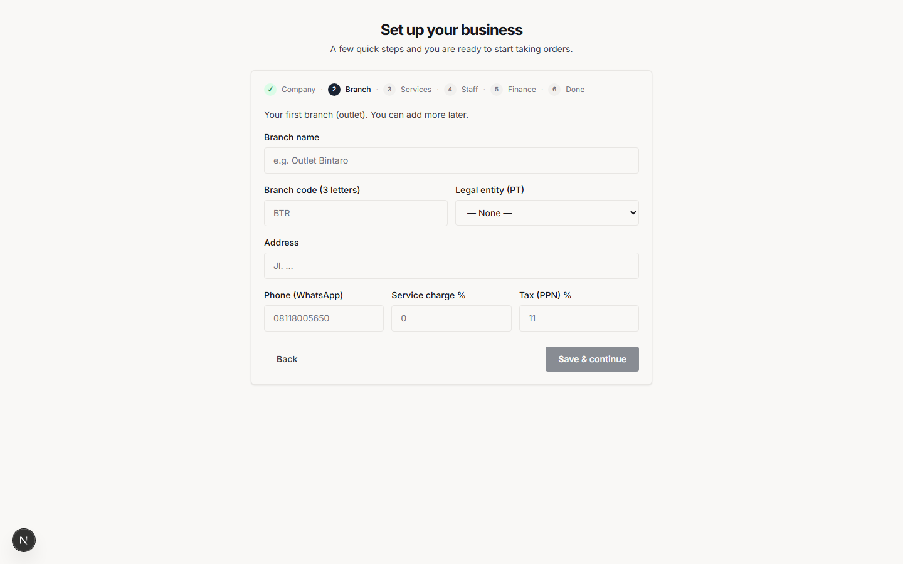

**Step 3 · Services.** Add your first few sellable services so the POS and eMenu aren't empty — each
gets a business unit (**AIRE** wash / **LEAD** detail), a category and a price. You can add the rest
later on the full Services page (§4.4).

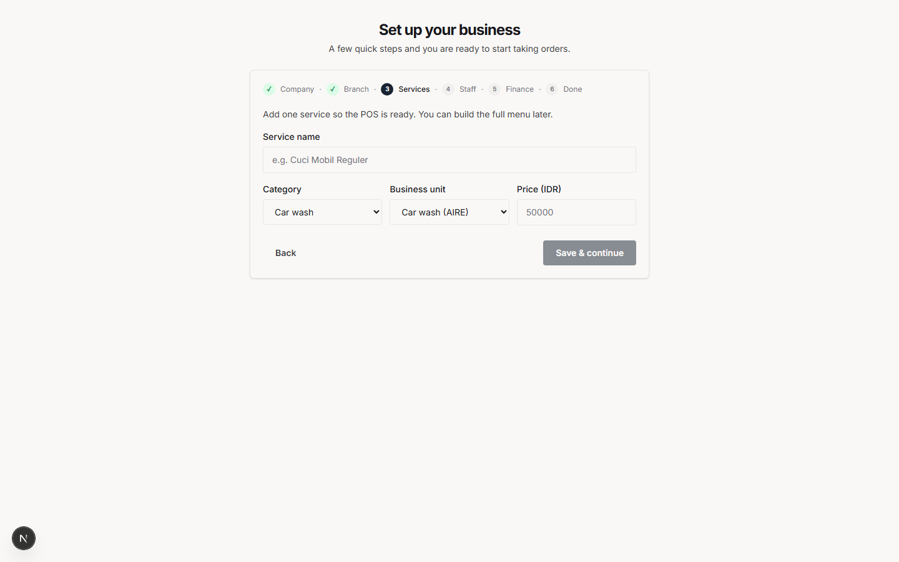

**Step 4 · Staff.** Create logins for the people who'll run the counter — pick a role (Outlet Admin or
Cashier) and the branch they work at. You can add and re-assign staff any time afterwards (§4.8).

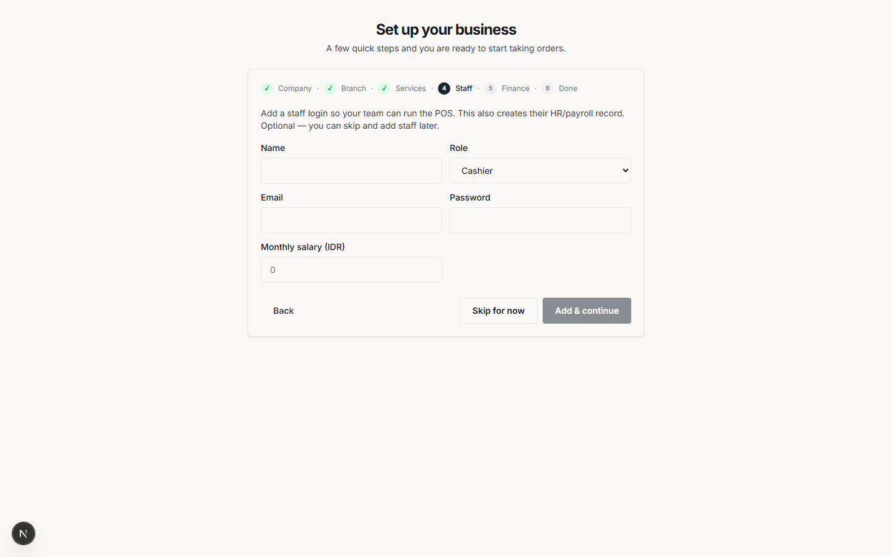

**Step 5 · Finance.** Turn on the finance defaults — chart of accounts, PPN tax, and payroll scaffolding
— in one step so your reports and accounting work from day one. (This is the same **Finance setup**
you can re-run later; see §11.)

**Step 6 · Done.** A summary of what's set up and the recommended next actions.

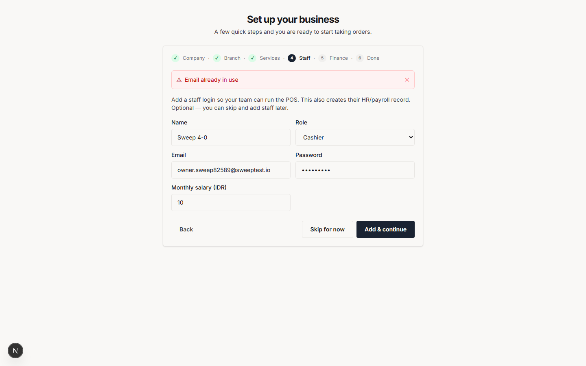

> **The wizard is optional and nothing it sets is locked.** You can skip it entirely and configure each
> area from its own page below — the wizard just does the essentials in a sensible order. Everything you
> enter here can be changed later from the matching Settings/Dashboard page.

---

## 4. Setup in detail — do these in order

Even if you used the wizard, here's every setup area and what it does. **Do them top to bottom** the
first time.

### 4.1 Branding (Settings → Branding)
Set your company name, logo, colours, fonts and dark-mode policy. This themes your **whole app** and
your **public pages** (eMenu, kiosk, member portal). Your read-only **tenant code** is shown here.
(Full Settings walkthrough in §11.)

### 4.2 Branches — your outlets
**Sidebar → Branches** (`/dashboard/branches`). Add each physical outlet.

1. Click **+ Add Branch**.
2. Enter the **name**, a **3-letter code**, the **legal entity** (if you use them), **address**,
   **maps link**, and **phone**.
3. Save.

> ⚠️ **The branch phone matters.** Portal bookings send their confirmation link to the **branch
> phone over WhatsApp**, and membership expiry/notification messages use it too. Set a real,
> WhatsApp-capable number.

> **Branch phone vs. per-branch AI line — two different things.** The phone here is a **contact
> number** for notifications. If you want each outlet to run the **WhatsApp AI agent on its own
> number** (so customers of the Bintaro branch chat a different line than the Serpong branch), that's
> a separate switch on the **Agentic AI** page — see §10.2. Leaving it off means every branch shares
> one business-wide WhatsApp line.

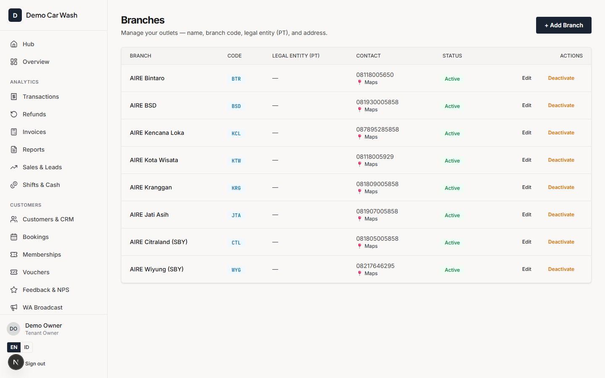

### 4.3 Catalog — categories & brands
**Sidebar → Catalog** (`/dashboard/catalog`). Create the **product categories** and **brands** you'll
tag services and products with.

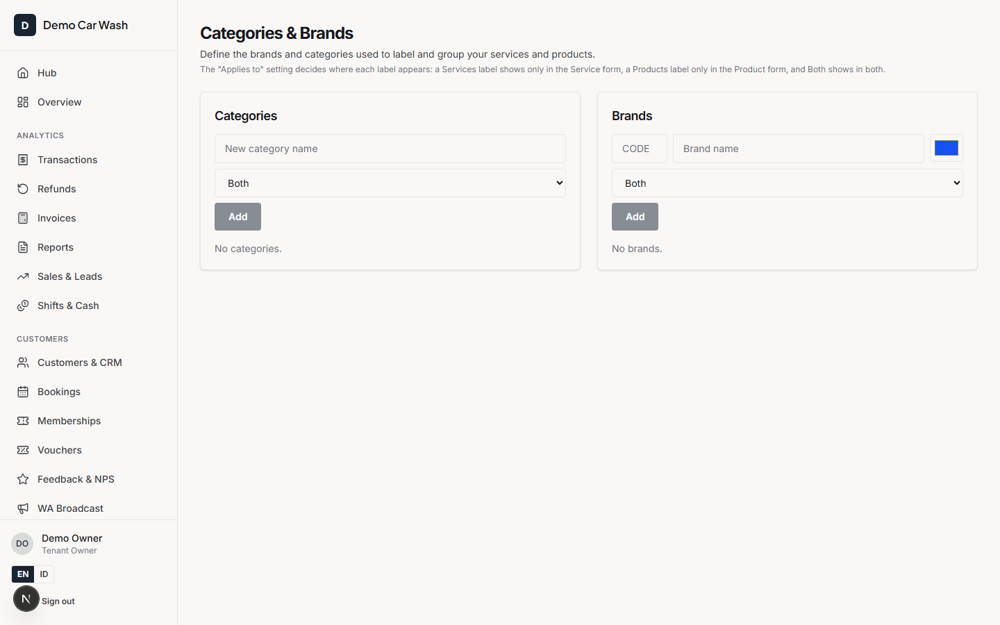

### 4.4 Services — your sellable menu
**Sidebar → Services** (`/dashboard/services`). This is what appears on the POS and public eMenu.

1. Click **+ Add Service**.
2. Give it a **business unit** — **AIRE** (car wash) or **LEAD** (detailing) — a **category**, and a
   **price**. Optionally scope it to specific branches.
3. Optionally attach a **Recipe** (the **Recipe** action on each row) — see §7.
4. **Active** services show on the POS; inactive ones are hidden.

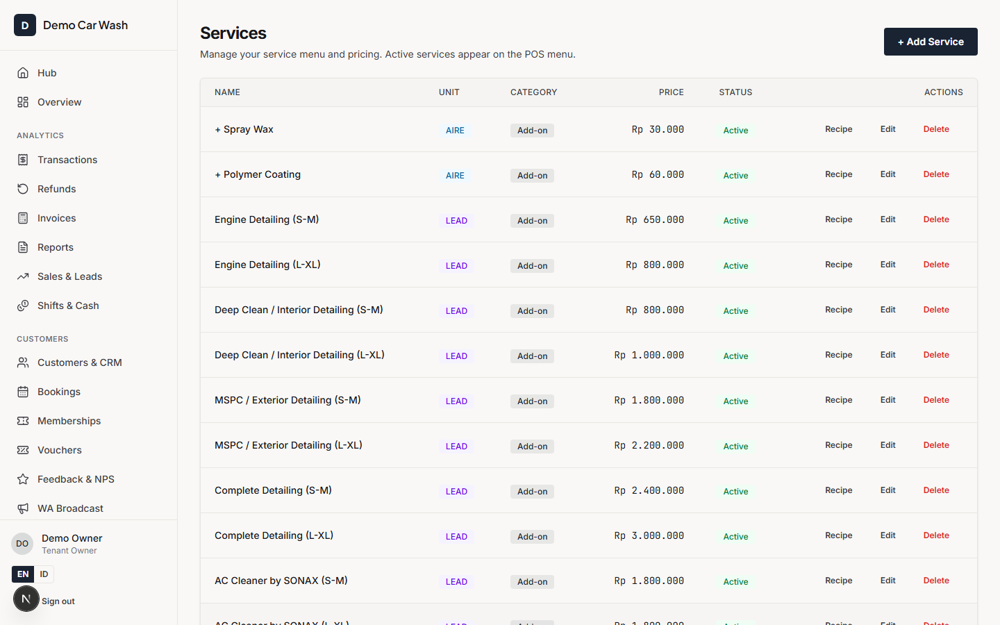

### 4.5 Products (retail items)
**Sidebar → Products** (`/dashboard/products`). Physical goods you resell (e.g. air fresheners).
Add name, category, price, and stock behaviour.

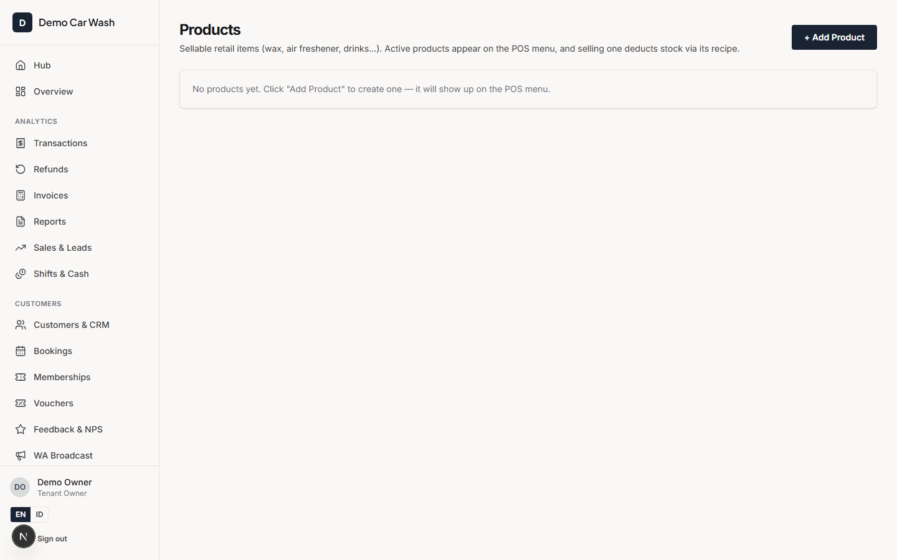

### 4.6 Payment methods (the POS buttons)
**Sidebar → Payment Methods** (`/dashboard/payment-methods`). Define the payment buttons cashiers see
per branch — cash, QRIS, EDC, card, transfer — each with a colour/logo.

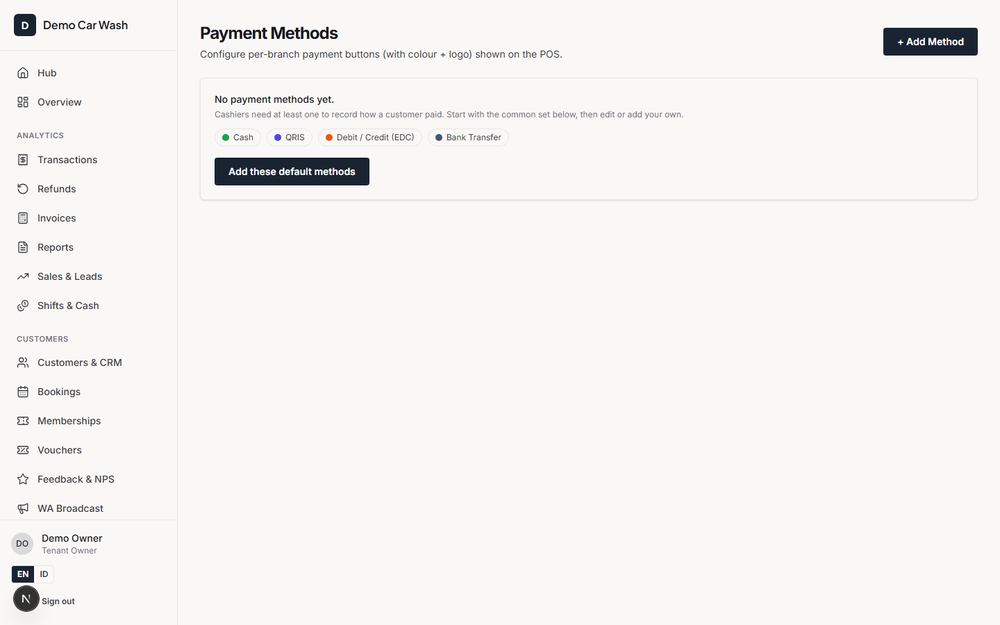

### 4.7 Payment gateway (online payments)
**Sidebar → Payment Gateway** (`/dashboard/payment-settings`). Choose your provider (**Xendit /
Midtrans / Stripe**) and enter live keys — or switch on **Sandbox** to demo the full QRIS flow
without a real gateway. Secrets are stored encrypted.

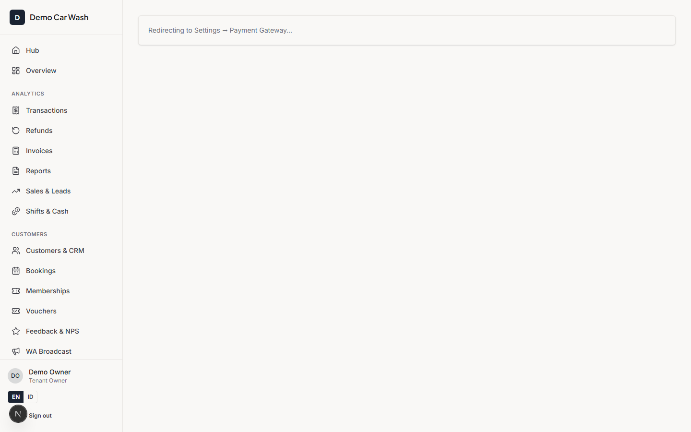

### 4.8 Users & roles (staff logins)
**Sidebar → Users & Roles** (`/dashboard/users`). Create logins for your staff.

1. Click **+ Add** (or **Invite**).
2. Enter their details and assign a **role** — a base role (**Outlet Admin** or **Cashier**) or a
   **custom role** with specific permissions.
3. Place them in **one or more branches**.

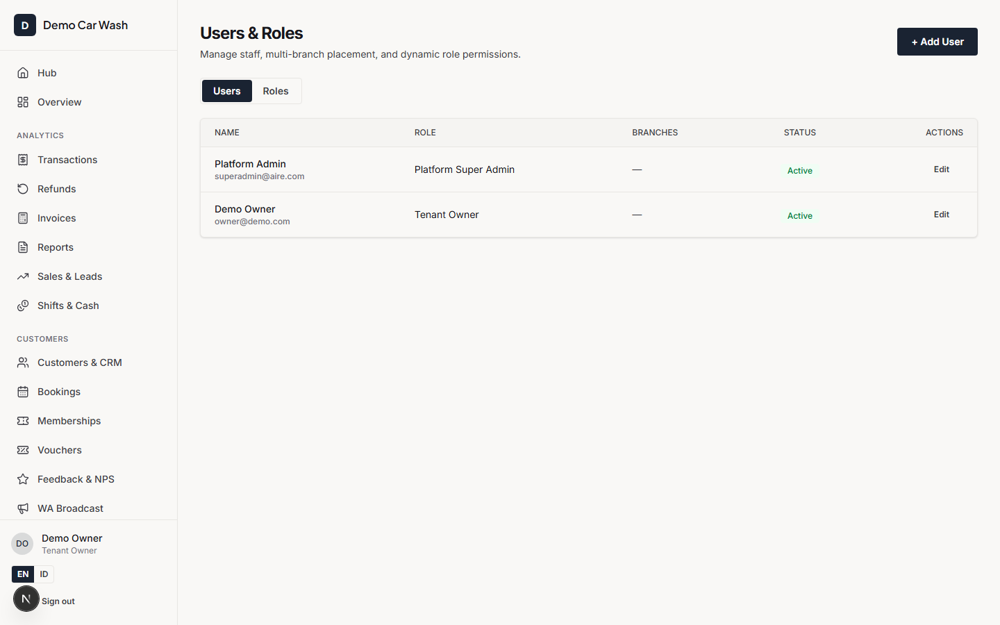

### 4.9 Vehicle catalog
**Sidebar → Vehicles** (`/dashboard/vehicles`). The brand → type lists that power the vehicle
dropdowns at the POS and kiosk. Comes pre-seeded for the Indonesian market; edit as needed.

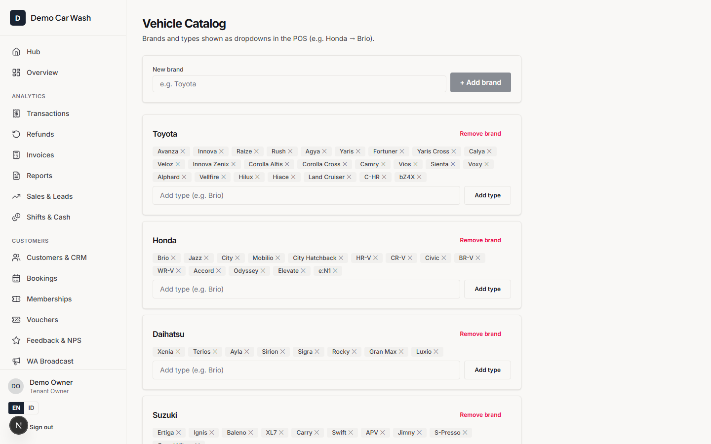

### 4.10 Legal entities (optional)
**Sidebar → Legal Entities** (`/dashboard/legal-entities`). If you invoice under one or more
companies (PT), record them here and assign each branch to one.

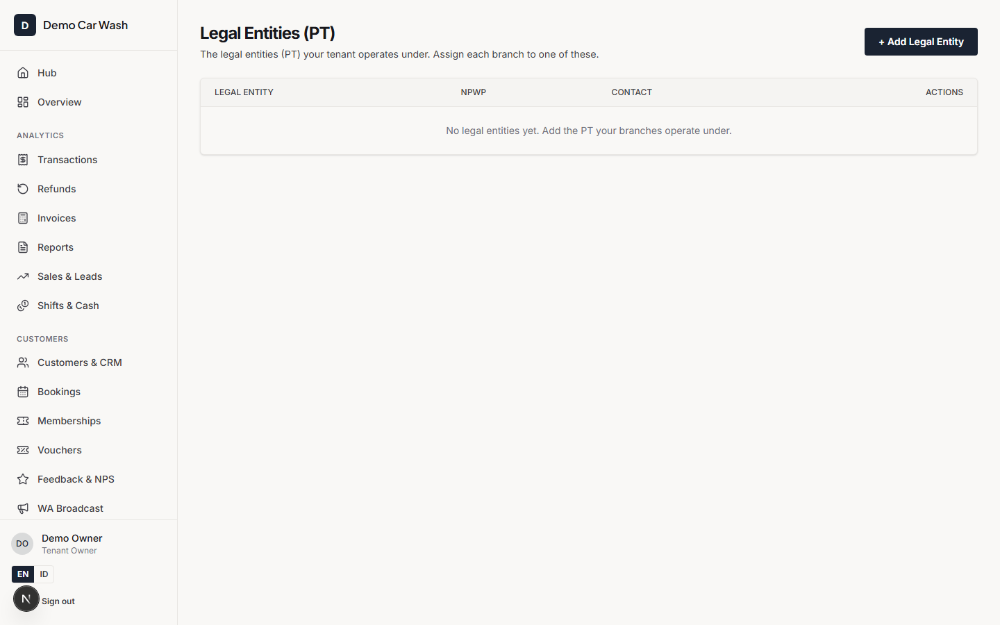

---

## 5. Customers, memberships & bookings

### 5.1 Customers & CRM
**Sidebar → Customers & CRM** (`/dashboard/crm`). The directory of **every** customer — members and
non-members — with new-customer growth. Each row shows a **membership badge** (Member / grace /
suspended / past member, or plain Customer). You can **Edit** and **Delete** a customer here; deep
membership management (renew, suspend, cards, history) lives on the **Memberships → Members** tab.

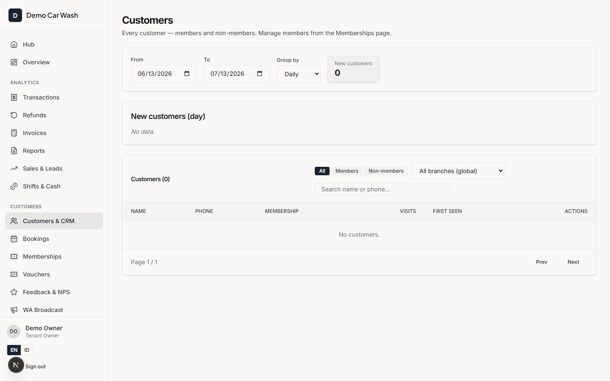

### 5.2 Memberships
**Sidebar → Memberships** (`/dashboard/memberships`). Three tabs:

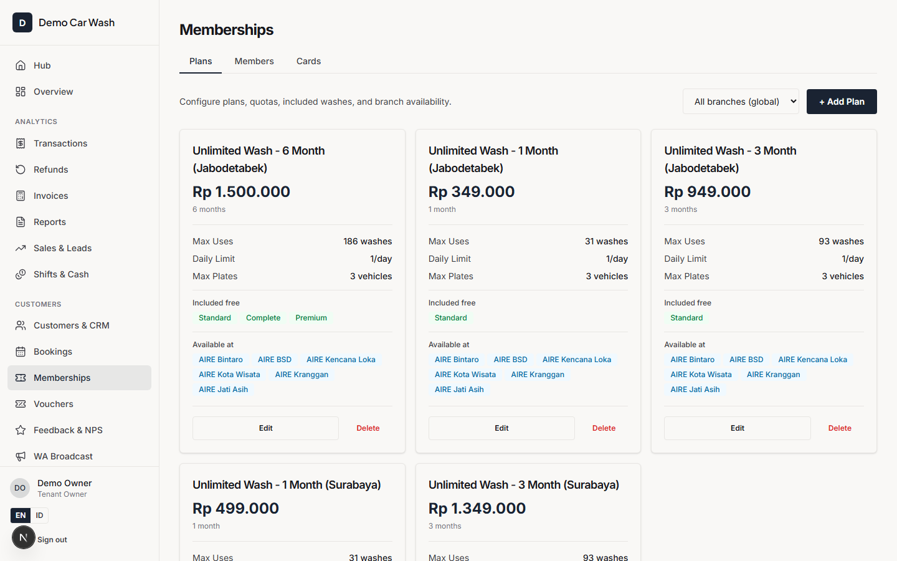

- **Plans** — create membership plans. Click **+ Add Plan** and set: price, duration
  (1 / 3 / 6 / 12 months), **usage quota** (max uses), **daily limit**, **max plates**, the
  **free washes** and **discounted services** (a % per service), a **WhatsApp welcome** toggle,
  which **branches** it's available at, and an optional cross-branch **settlement amount**.
- **Members** — every membership ever sold, with a status filter and search. Click a member to open
  their detail: card preview, plan/period/uses, event **history**, and the **Print card / Renew /
  Suspend / Reactivate** actions.
- **Cards** — design the printable card (drag fields, upload front/back background, choose
  number/barcode/QR, fonts and colours). Also at `/dashboard/membership-card`.

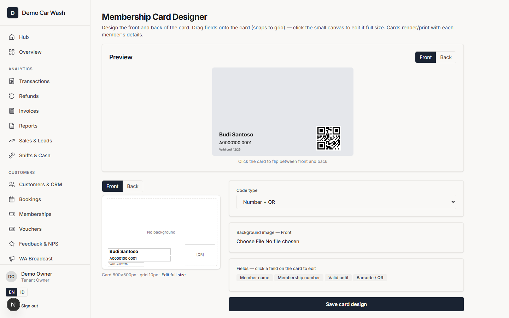

> **How the membership lifecycle works** (sale → activate → benefits → grace → revoked → renewal,
> plus the 12-digit number and cross-branch settlement) is documented in full in
> [06 · Membership lifecycle](../tech/06-membership-lifecycle.md). **Short version:** benefits apply
> only while a membership is truly **active**; after the end date it enters a **14-day grace** window
> (renewable, but no benefits), then becomes **revoked**. Renewal always takes **payment first** and
> only extends once paid.

### 5.3 Bookings
**Sidebar → Bookings** (`/dashboard/bookings`). Create and confirm appointments. Bookings that
customers request from the member portal land here; **confirm** one to drop that car onto the branch
queue for its time slot (the customer is notified over WhatsApp).

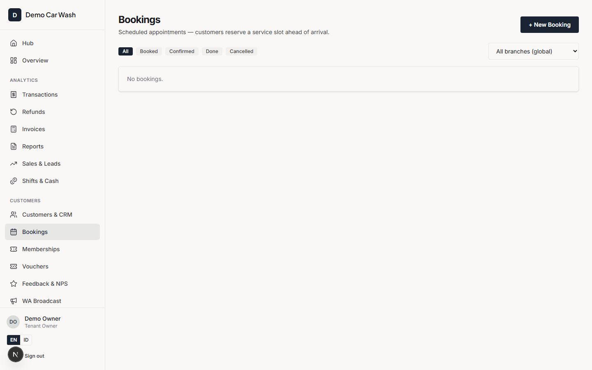

### 5.4 WhatsApp broadcast (WA Broadcast)
**Sidebar → WA Broadcast** (`/dashboard/broadcast`). Send a one-off marketing message to a **segment**
of your customers over WhatsApp — a promo, a re-engagement nudge, a re-opening notice.

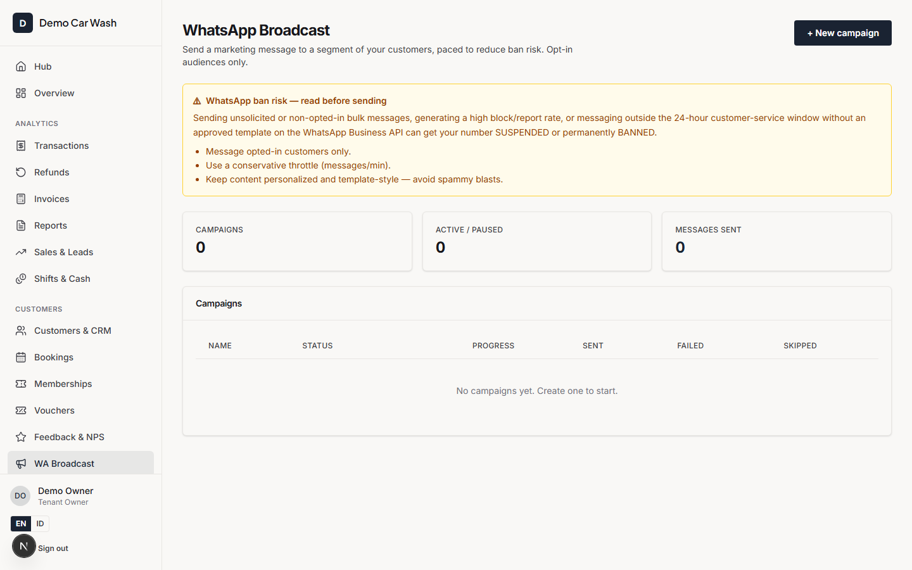

**How a campaign works:**

1. Click **+ New campaign**. Give it a **name** and pick an **audience segment**: *All customers*,
   *Active members*, *Expired members*, or *By tag* (then choose the tag). A live preview shows how
   many people match — split into **opted-in**, and **excluded (no consent)**.
2. Write the **message**. Use `{name}` anywhere to drop in each customer's name.
3. Set a **throttle** (messages per minute — lower is safer) and, optionally, a **schedule** time.
4. Click **Create draft**. Nothing sends yet.
5. In the campaign, tick **"I understand the WhatsApp policy & ban risk"** to unlock **Start sending**.
   You can **Pause**, **Resume**, or **Cancel** at any time; a live progress bar shows **sent / failed /
   skipped**, and you can open the recipient list to see per-person status.

> ⚠️ **This is the highest-risk feature in the app.** Bulk-messaging non-consenting numbers is the
> fastest way to get your WhatsApp line **banned by Meta**. By default airin **only messages customers
> who opted in**, and paces sends with the throttle. There's a checkbox to include non-opted-in
> customers — leave it off unless you truly know what you're doing. Keep throttle low, keep messages
> relevant, and warm up new numbers slowly.

---

## 6. Vouchers & promotions

### 6.1 Vouchers
**Sidebar → Vouchers** (`/dashboard/vouchers`). Define voucher-pack templates and sell/issue code
packs (a parent code + child codes, delivered over WhatsApp). There are also shareable digital
tickets with human-readable codes.

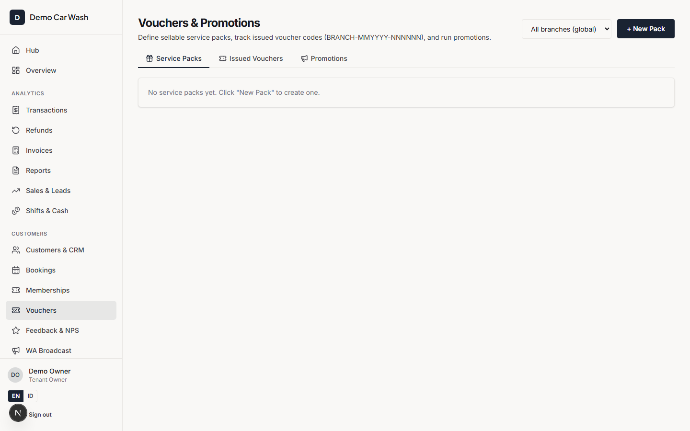

### 6.2 Promotions
**Sidebar → Promotions** (`/dashboard/promotions`). Time-boxed campaigns: a fixed or percentage
discount, a free product, a free voucher, or a future-discount — with optional trigger products,
branch scope, and a quota.

---

## 7. Inventory, recipes, COGS & finance

This chain is how airin tracks **true profit**, not just revenue.

### 7.1 Inventory
**Sidebar → Inventory** (`/dashboard/inventory`). Stock items per branch. Add items, **adjust**
in/out, and set **unit conversions** (buy in kg, consume in grams).

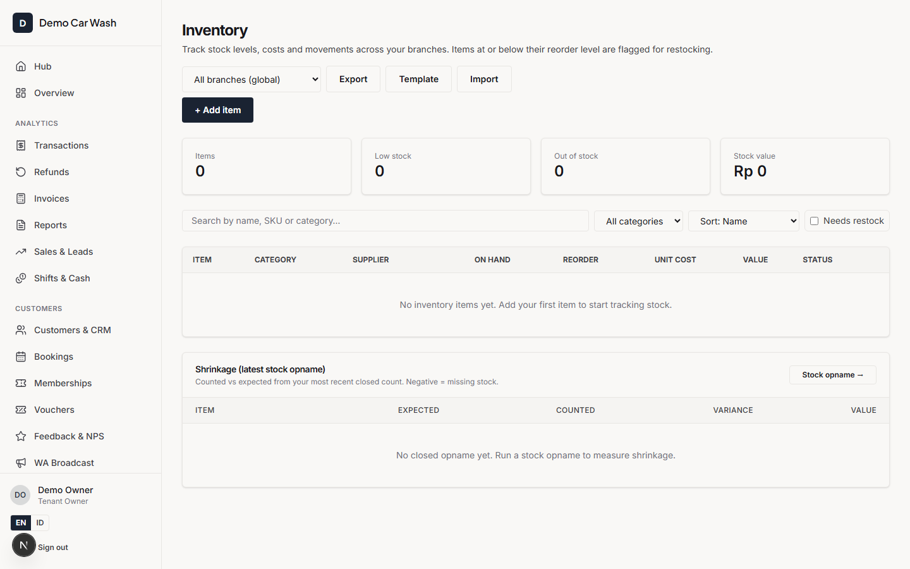

### 7.2 Recipes (attached to services)
On any service (**Services → Recipe**), define what it **consumes**: the inventory items used per
unit, plus non-physical cost lines (tax, profit, water, electricity — as a fixed amount or a % of
price). When that service sells, stock is deducted automatically and the unit cost is **frozen onto
the order line**, so your margins stay accurate even if you change the recipe later.

### 7.3 Procurement
**Sidebar → Procurement** (`/dashboard/procurement`). Suppliers and purchase orders. **Receiving** a
PO auto-restocks the linked inventory items.

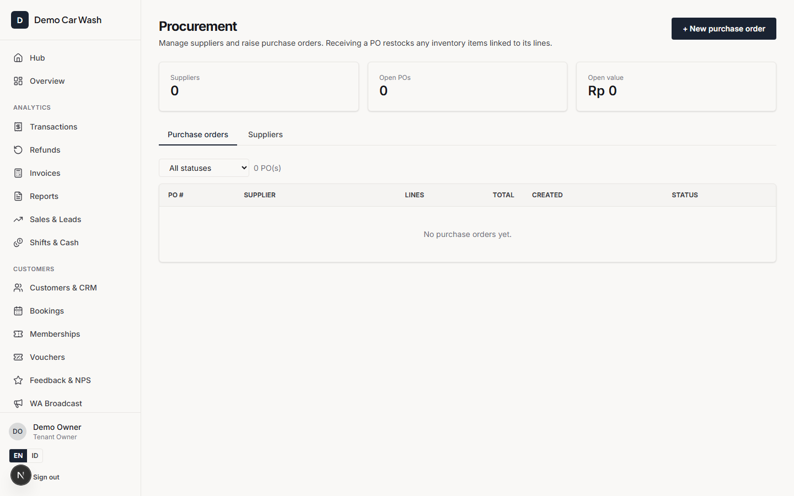

### 7.4 Stock opname (physical count)
**Sidebar → Stock Opname** (`/dashboard/opname`). Start a count → enter the **physical counts** →
**Close** to reconcile the system to reality and record the variance.

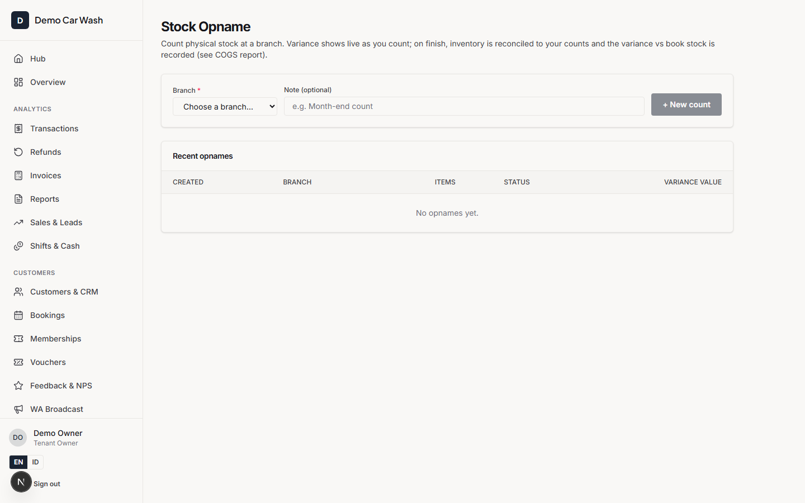

### 7.5 COGS & P&L
**Sidebar → COGS** (`/dashboard/cogs`). The true profit view: **revenue − cost of goods − expenses**,
per-product margin, and inventory variance.

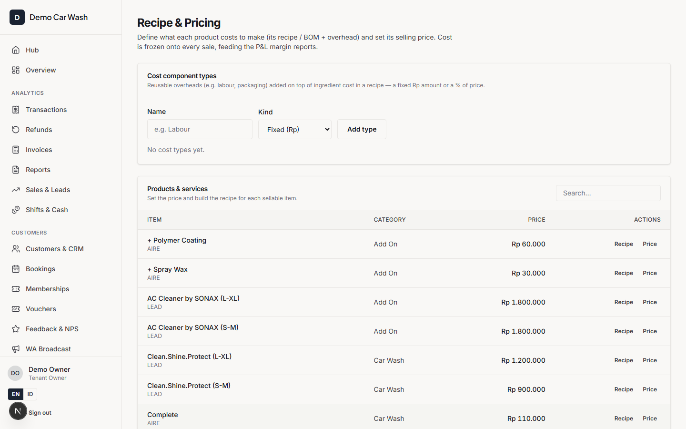

### 7.6 Finance
**Sidebar → Finance** (`/dashboard/finance`). Revenue / expense / net-profit summary with a forecast,
and **+ Record expense** to log outgoing costs by category. (Note: this page is *revenue − expenses*;
**COGS** is the page that also subtracts cost of goods.)

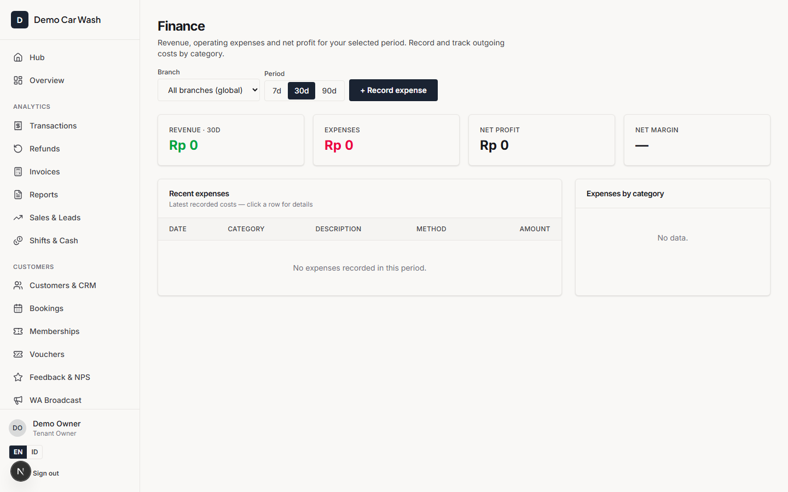

### 7.7 Settlement (cross-branch)
**Sidebar → Settlement** (`/dashboard/settlement`). When a member washes at a branch other than their
"home" branch, one branch owes the other. Settle/payout a branch pair here and see the history.

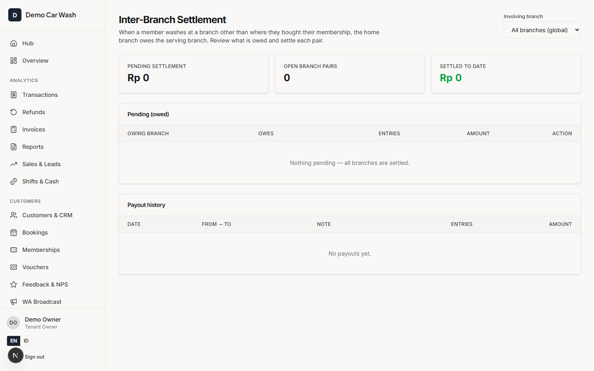

### 7.8 Accounting
**Sidebar → Accounting** (`/dashboard/accounting`). The double-entry ledger behind the numbers
(journal entries posted automatically by sales, opname, payroll, etc.).

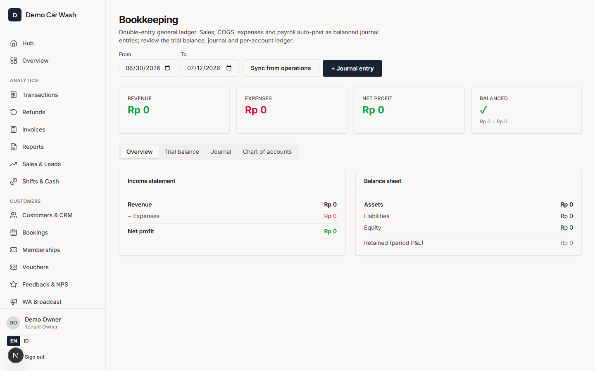

### 7.9 Tax invoices — Faktur Pajak / e-Faktur
**Sidebar → Tax Invoices** (`/dashboard/tax-invoices`). If your business is **PKP** (VAT-registered)
you can issue a **Faktur Pajak** against an order and export a file ready to import into **Coretax /
e-Faktur**.

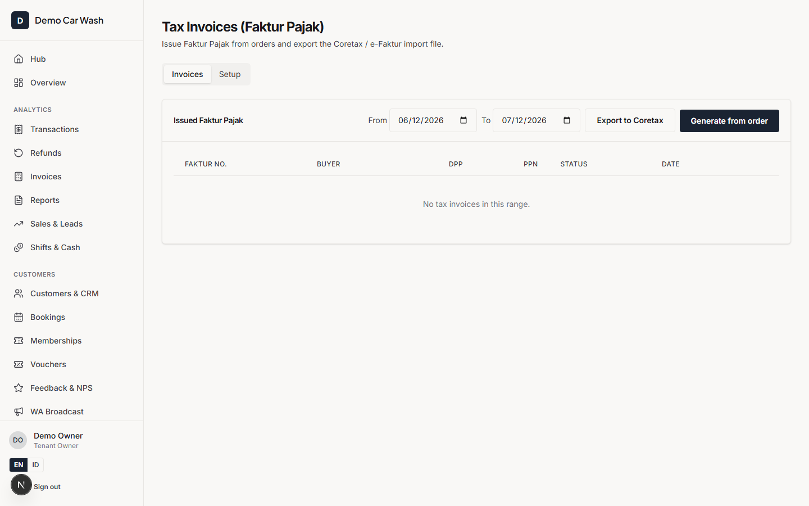

**One-time setup — the `Setup` tab.** Tick **Enable tax-invoice issuance**, then fill your **seller
identity**: **NPWP**, seller **name**, seller **address**, the **transaction code** (kode transaksi,
default `04`) and the **Faktur prefix** (default `010`). Save.

**Issuing an invoice — the `Invoices` tab:**
1. Click **Generate from order** and enter the **Order ID**. The order must already be
   **paid / confirmed / completed**.
2. Optionally enter the buyer's **NPWP**, **name** and **address** — leave NPWP blank to use the
   customer's stored tax identity (it will show *"No NPWP"* if they have none).
3. **Generate.** The Faktur appears in the table with its number, **DPP** (tax base), **PPN** (VAT,
   calculated at **11%**), status and date. **Print** opens an A4 Faktur Pajak you can save or print.

**Exporting to Coretax.** Pick a **From / To** date range and click **Export to Coretax** — you get a
CSV in Coretax import format, and the exported invoices flip to status **exported** so you can see
what's already been filed.

---

## 8. Reporting

- **Overview** (`/dashboard`) — headline KPIs, revenue forecast vs target, AI proposals, and quick
  links, with a branch filter.
- **Reports** (`/dashboard/reports`) — four tabs over one set of filters (date range, business unit,
  branch):
  - **Reports** — consolidated metrics (KPIs, AIRE/LEAD split, payment methods, top services, daily
    sales, per-shift cash) with **PDF/CSV export**.
  - **Daily operations** — one row per day, laid out like the sheet an outlet keeps by hand: revenue
    split per payment method **and business unit** (QRIS/debit/card each split AIRE vs LEAD, cash and
    transfer whole), then the day's transactions, member vs non-member, items sold by category,
    memberships **sold new and renewed by plan length**, and voucher packs. Revenue is what you
    charged — QRIS/EDC fees are not deducted.
  - **Sales per agent** — an item × agent matrix: new memberships and renewals (by plan length),
    voucher packs, and each product/service, counted per salesperson. It follows the **salesperson
    credited on the order**, not the cashier, and orders with nobody credited sit in a final
    "Tanpa agent" column so the totals still add up.
  - **Report Designer** — layout/branding for printed reports.

  Both operational tabs export to CSV.

  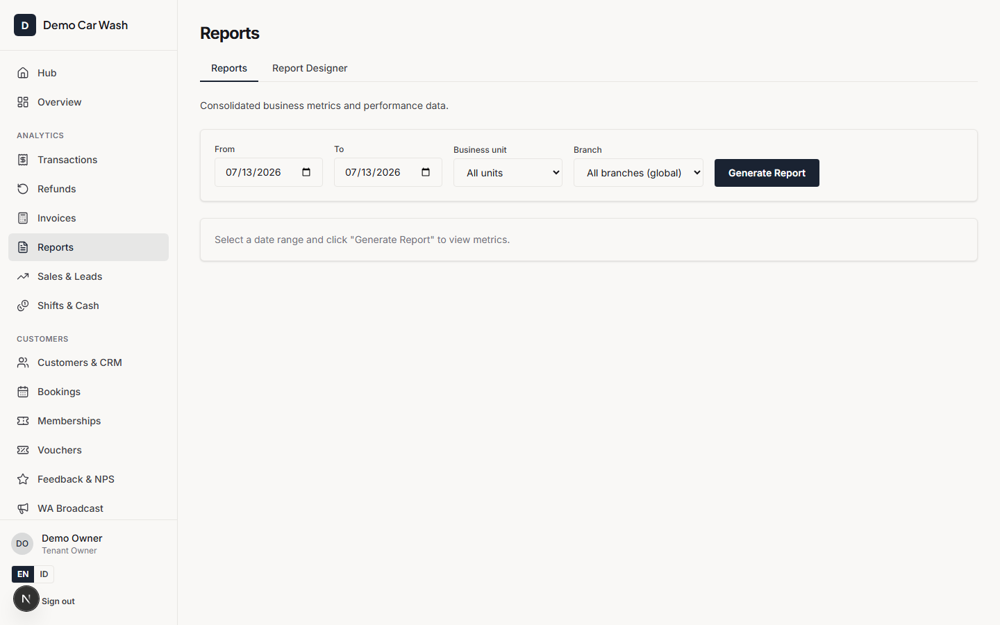

- **Transactions** (`/dashboard/transactions`) — charts plus the orders table (view / edit / void),
  with **Excel + PDF export**. The orders table shows the **payment method** and a **Member** badge,
  and can be filtered by either.

  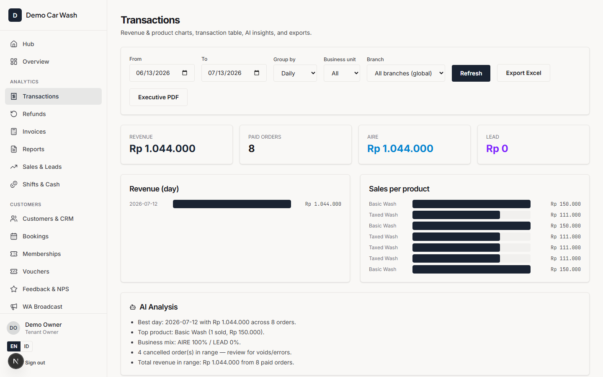

- **Sales & Leads** (`/dashboard/sales`) — attainment vs a monthly **target you set**, a run-rate
  forecast, and a simple lead pipeline (new → contacted → won).

  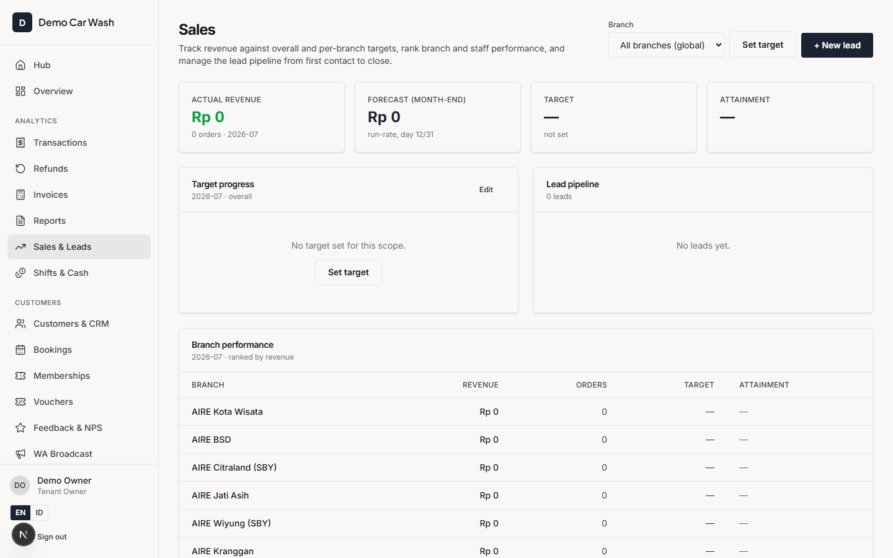

- **Invoices** (`/dashboard/invoices`) — print/save A4 invoices for paid orders.

  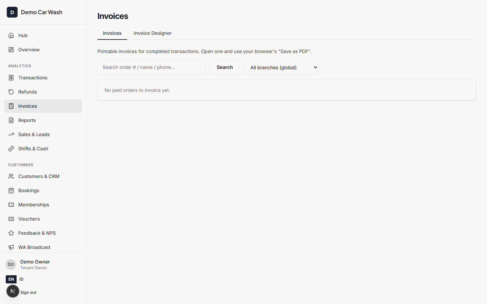

- **Shifts & Cash** (`/dashboard/shifts`) — every register session across all branches, so you can
  reconcile cash without standing at the counter. Three tiles (Open now, Cash sales, Net variance)
  summarise the **rows currently filtered** (by branch and date), and the table shows each shift's
  **operator, opening float, cash & expected & counted amounts, and variance** (green = balanced,
  amber = small gap, red = investigate). Open a shift to see its **petty-cash** movements, any logged
  **issues**, and notes. This page is **read-only** — cashiers open and close shifts at the POS.

  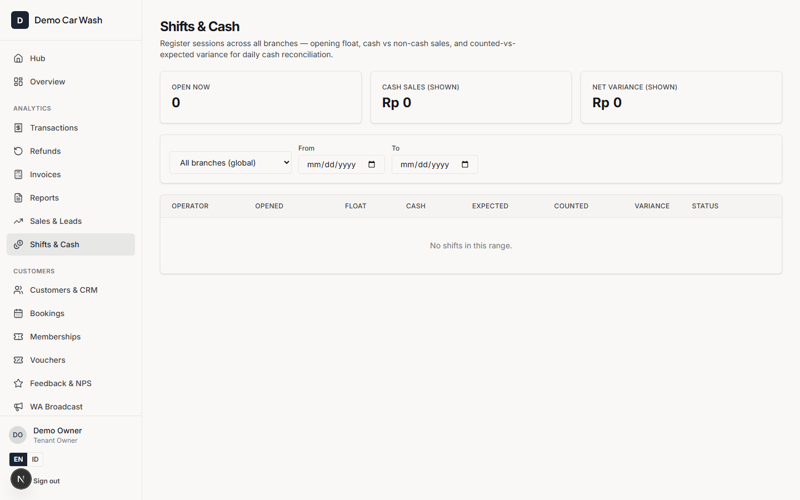

- **Refunds** (`/dashboard/refunds`) — the history of money returned to customers (full and partial).
  Filter by date and **export CSV**; each row shows the refund number, original order, amount, method,
  reason and branch, and opening one shows the refunded line-items and the **PPN reversed**. Refunds
  are *created* on the order/POS screen — this page is the record of them.

  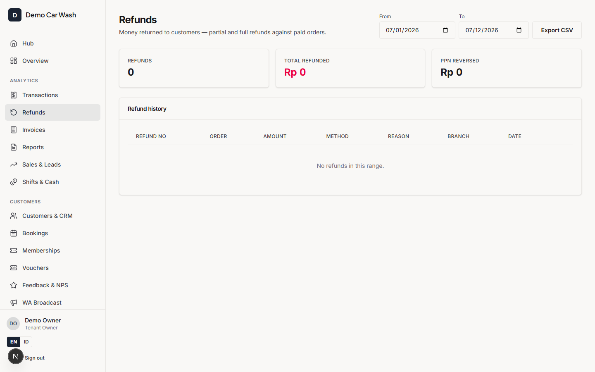

- **Feedback & NPS** (`/dashboard/feedback`) — post-service ratings and NPS collected over WhatsApp.
  The **Overview** tab shows your **average rating**, **NPS score**, response count, a star-distribution
  chart and recent comments; the **Setup** tab is where you switch it on (see §11.x below). **Export CSV**.

  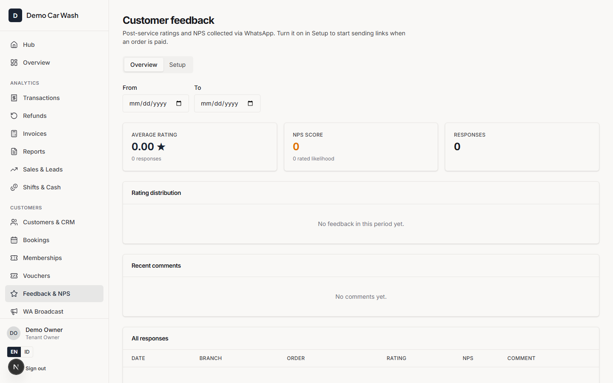

- **P&L** (`/dashboard/pnl`) — the profit-and-loss statement built from your accounting ledger.

  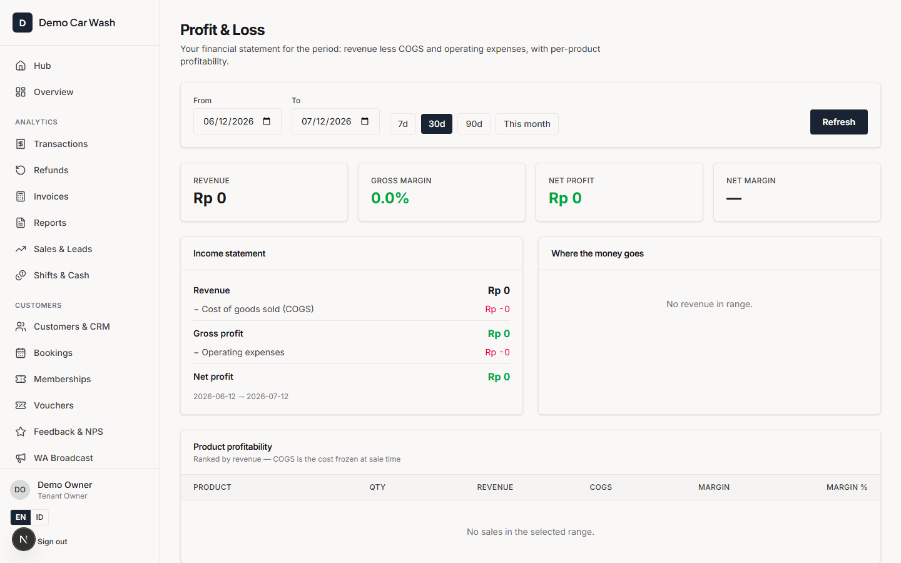

---

## 9. People — HR & payroll

- **HR** (`/dashboard/hr`) — employees (link a login to an employee record), schedules, clock in/out,
  leave approvals, and holidays.

  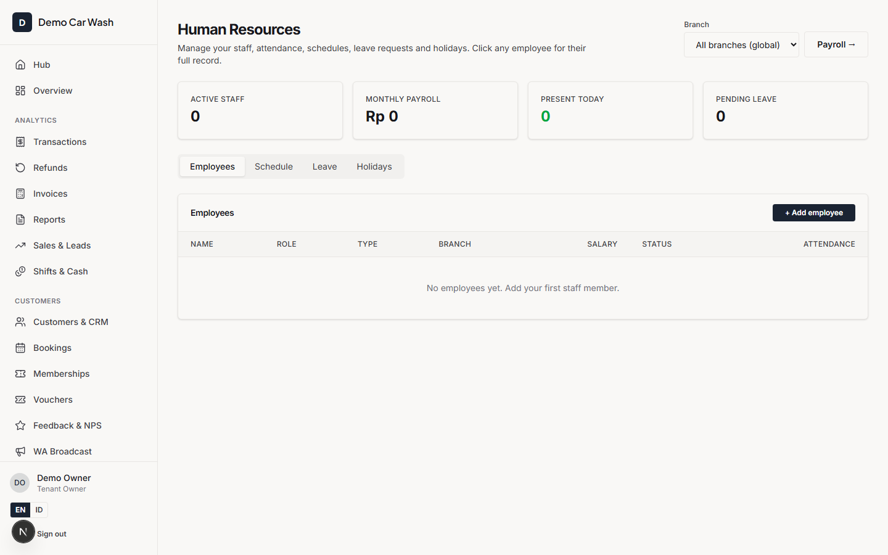

- **Payroll** (`/dashboard/payroll`) — generate a payroll run for a period (base salary + bonuses −
  deductions − advances − loan installments − unpaid leave), review payslips, **Finalize** to lock,
  and **export** payslips as CSV.

  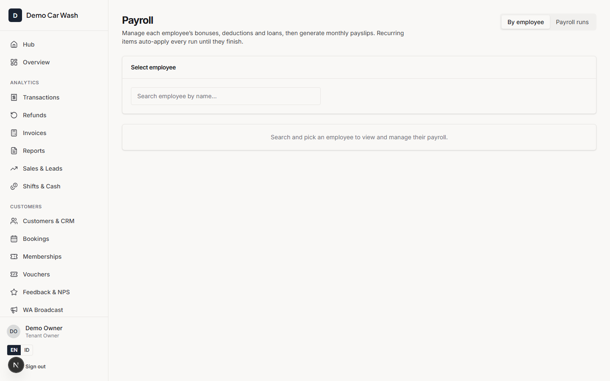

- **Commission** (`/dashboard/commission`) — reward staff per job; whatever accrues flows into the
  next **payroll run automatically as a bonus**. Two tabs:

  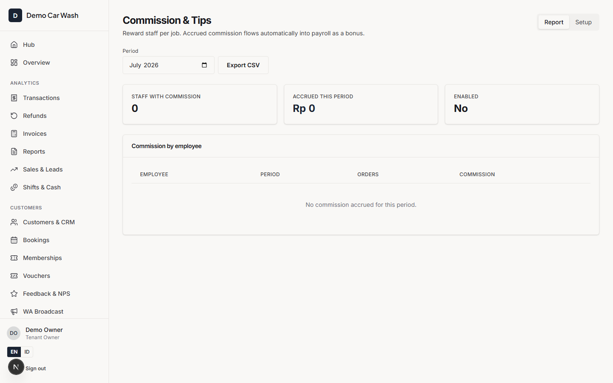

  - **Report** — pick a month to see commission accrued **per employee** (orders and rupiah), with
    **Export CSV**.
  - **Setup** — switch on **per-job commission accrual** (and optionally **tips capture**), then define
    the **rules**. Each rule has a **scope** and a **mode**:
    - **Scopes**, most-specific first: **per staff → service/product → category → global**. The most
      specific matching rule wins.
    - **Modes:** *% of sale* (`pct_of_sale`), *% of a service line* (`per_service_pct`), *fixed per unit*
      (`per_service_fixed`), or *fixed per job* (`fixed_per_job`, paid once per order).
    - The **Per-staff rules** panel lets you apply a rate to many employees at once (a per-staff rate
      **overrides** the general rules for that person), and **Monthly target bonuses** pay a flat bonus
      when an employee's monthly sales cross a target you set.

  > **Tip:** start with a single **global** rule (e.g. 5% of sale), confirm the Report looks right for a
  > week, then add per-service or per-staff overrides. Because commission posts into payroll, changing a
  > rule affects only **future** accrual — already-run payroll is untouched.

---

## 10. AI assistant & WhatsApp

airin has **two different AIs**, and it's important not to confuse them:

- the **AI Assistant** (§10.1) is *your* private co-pilot — it can see your whole business;
- the **WhatsApp agent** (§10.2) talks to *customers* — it can only ever see the one person chatting.

### 10.1 AI Assistant (your co-pilot)
**Sidebar → AI Assistant** (`/dashboard/assistant`). Chat with a co-pilot that knows your business.
Ask things like *"how's business today?"*, *"which memberships expire in 30 days?"*, or *"show my last
10 orders"* (there are suggestion chips for these).

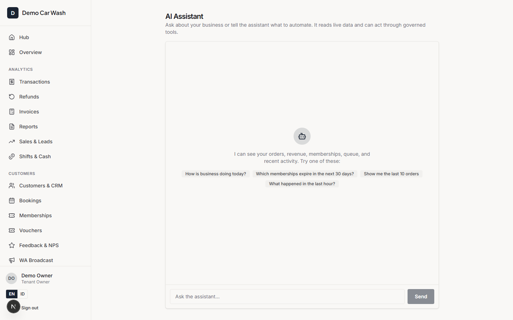

- **What it can read:** your whole-business data — orders, customers, memberships, services, queue,
  inventory & low stock, finance & sales summaries, HR, procurement, shifts, payroll and loans. (This
  is deliberately broader than the customer WhatsApp agent.)
- **What it can do — with your approval:** create a campaign, send a retention offer, adjust stock,
  record an expense, create a purchase order, add an employee, and more. Each action is governed by an
  **approval mode** you set (Settings → automation). In **approval-required** mode the assistant
  doesn't act — it files a **proposal** that shows up on your **Overview** (AI Action Proposals) for
  you to approve or reject. In **autonomous** mode it acts immediately and writes an audit entry.

### 10.2 Agentic AI / WhatsApp (the customer-facing agent)
**Sidebar → Agentic AI** (`/dashboard/ai-agent`). This is where you connect WhatsApp and shape how the
agent talks to customers.

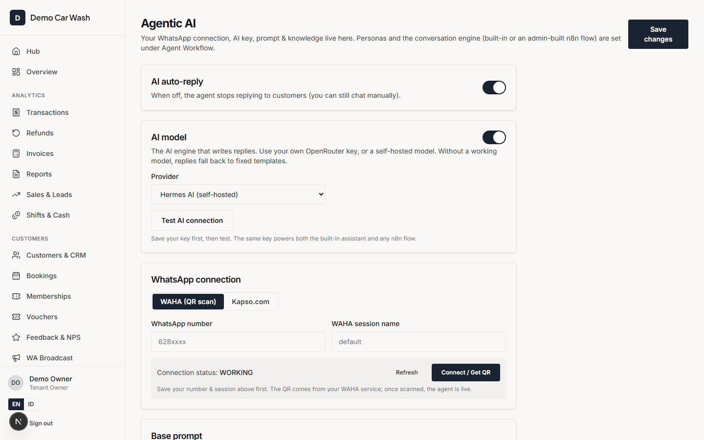

**Connect a number.** In **WhatsApp connection**, choose a provider — **WAHA** (scan a QR with the
phone that will be the agent) or **Kapso.com** (paste an API key) — enter the **WhatsApp number** and,
for WAHA, a **session name**, then **Connect / Get QR** and scan.

**Simulation mode (test without a real number).** Flip **Simulation mode** on to trial the whole flow
with **no real WhatsApp line**: outgoing messages are *captured* in the Conversations page's **Mock
outbox** instead of being sent. Turn it **off** to go live. *(On the production server this must be off
to actually message customers.)*

**Shape the agent:**
- **AI auto-reply** — the master switch for the agent replying at all (turn off to handle chats manually).
- **AI model** — turn AI on, pick the **provider** (OpenRouter with your API key, or self-hosted Hermes
  AI) and use **Test AI connection** to confirm it works. The same key powers the co-pilot and any n8n
  flow. *(If AI is on but no key is set, customers get plain template replies — the page warns you.)*
- **Base prompt** — the agent's persona and core instructions.
- **Product knowledge** — hours, products, membership info, SOP the agent should know.
- **Agent skills** — what it's allowed to do, one per line.
- **Limits & escalation** — a **max messages per user per day** cap, and an **escalation number**
  (a supervisor) the agent hands off to.

**Per-branch WhatsApp lines.** In **Separate WhatsApp per branch**, turn on `perBranchWaEnabled`
(save the page first) to give **each outlet its own number & QR**. The escalation number, AI model,
prompt, knowledge and daily cap stay **shared**; only the number is per-branch. A branch with **no**
number set is simply *not connected* — it does **not** fall back to the main line. (The built-in agent
uses the branch line; n8n flows and broadcasts always use the main line.)

### 10.3 Agent Workflow (personas & routing)
**Sidebar → Agent Workflow** (`/dashboard/agents`). Manage AI **personas** — each has a **role**
(personal assistant / customer service / sales / supervisor), a description, a prompt, and an
Active toggle. The role controls which customer tools the persona may use (e.g. *customer service*
can't create bookings). Under **Agent engine**, choose **routing**: the built-in engine, or a
published **n8n flow** (pick the WhatsApp flow and optional automation flow, and **generate a bridge
token** to paste into the n8n credential). n8n flows themselves are built by the platform team.

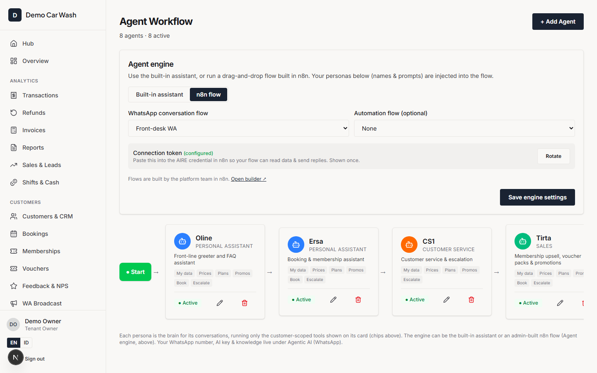

### 10.4 Conversations
**Sidebar → Conversations** (`/dashboard/conversations`). The live customer ↔ AI chat log. Read any
thread, **toggle AI on/off** for a single conversation, **reply manually**, **summarize**, or start a
**new session**. Two things worth knowing:
- **Booking approvals** — when the agent proposes a booking and the customer confirms it on WhatsApp,
  it lands here for you to **Approve / Reject** (you can also reply *TERIMA / TOLAK* on the escalation
  number). Confirmed bookings then drop onto the branch queue.
- **Mock outbox / Simulate inbound** — in Simulation mode, this page shows captured outbound messages
  and lets you fake an inbound message to test the agent end-to-end.

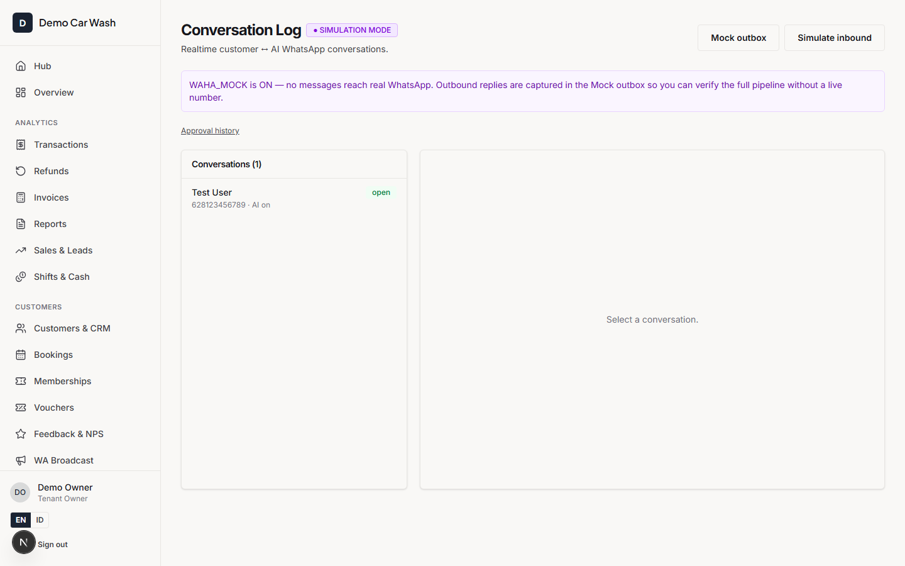

### 10.5 Monitoring
**Sidebar → Monitoring** (`/dashboard/monitoring`). Real-time AI usage: **invocations, errors, token
count, estimated cost**, calls broken down by type, top tools, and recent invocations/events. Watch
the **error rate** and **token cost** here.

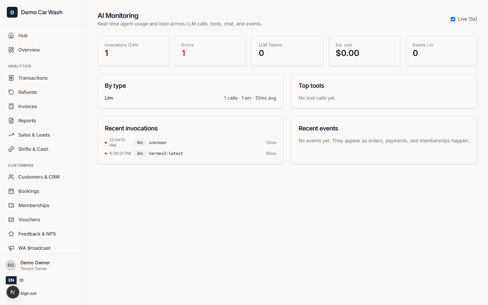

> **Data safety (the customer agent).** The WhatsApp agent is bound **server-side to the phone number
> that messaged you** — it can only read **that one customer's** own memberships, orders, queue,
> vouchers and bookings, plus strictly **public** info (prices, plans, promos). It **cannot** reveal
> other customers, your revenue, payroll or costs — regardless of what a customer types to try to
> trick it. Your co-pilot (§10.1) is the opposite: it sees everything, because it's *you*.

---

## 11. Settings & configuration

**Sidebar → Settings** (`/dashboard/settings`). Your tenant identity (read-only **tenant code**),
**branding**, WhatsApp/AI toggles and LLM provider/key, and device discovery. Secrets are encrypted.

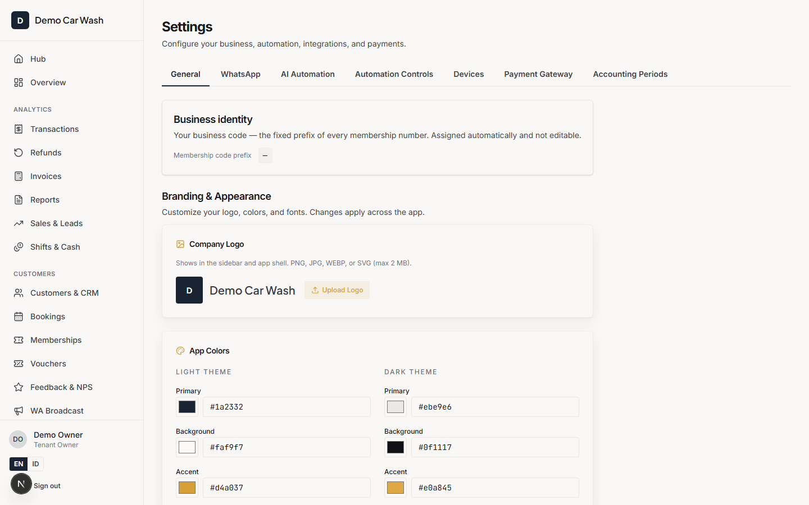

Related setup pages:
- **Finance setup** (`/dashboard/finance-setup`) — one-click provisioning of finance defaults,
  payroll, PPN tax and pay-day automation.

  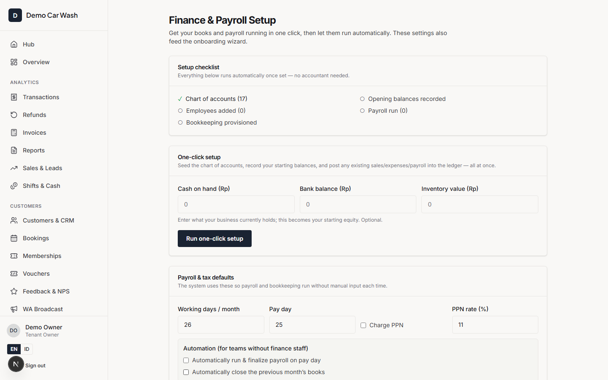

- **POS Terminals** (`/dashboard/pos-devices`) — register the tablets/PCs that run the POS. Each
  terminal opens its **launch URL** once to become an authorized register (see the
  [Employee manual §1](03-employee-manual.md)).

  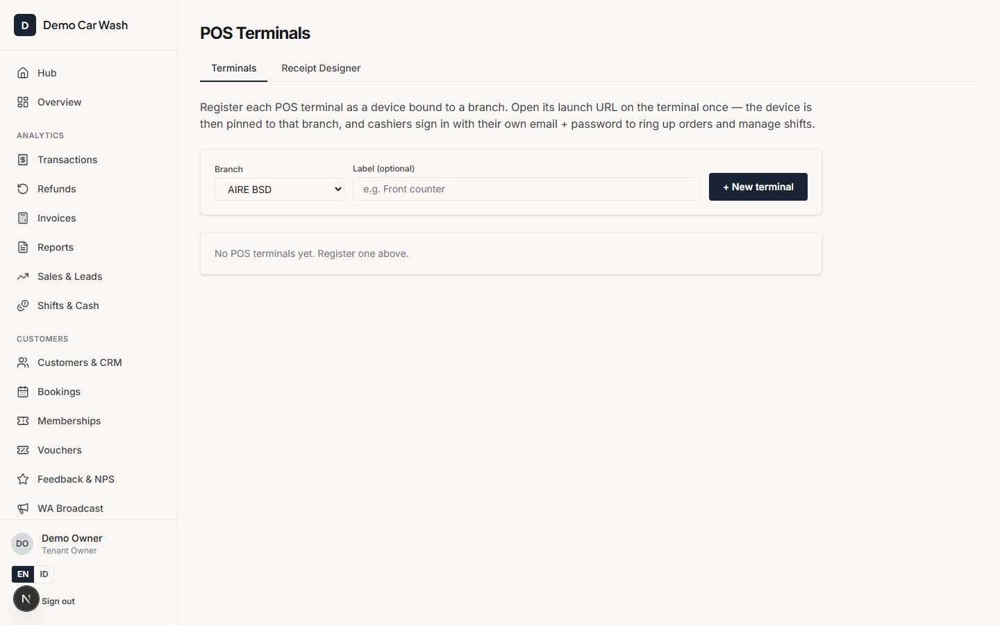

- **Kiosks** (`/dashboard/kiosks`) — register the self-service kiosk tablets the same way.

  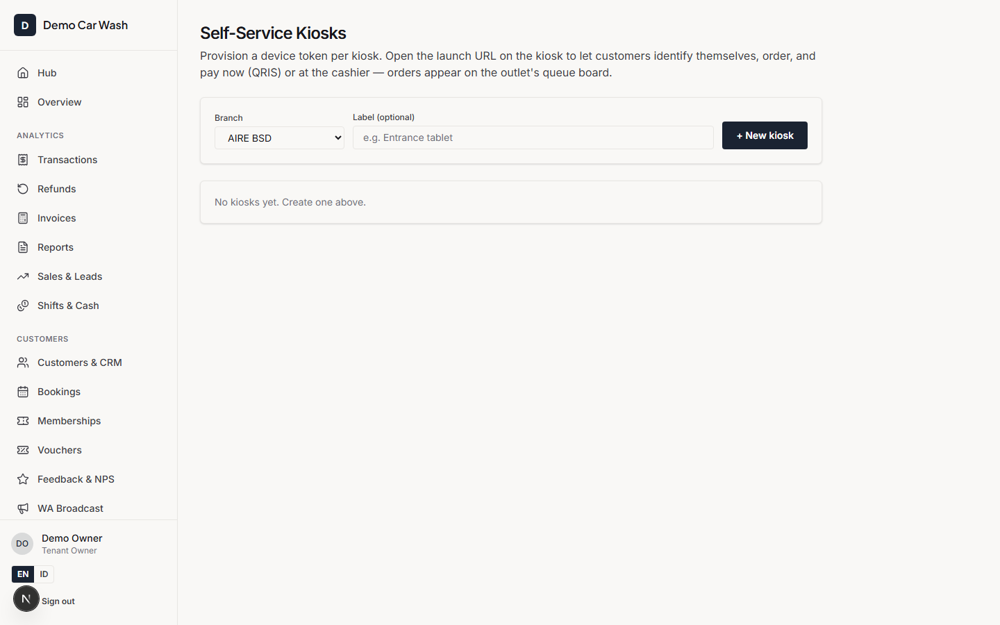

- **Designers** — drag-and-drop editors for every printed document: the **receipt**, **invoice**,
  **membership card**, **barcode label**, and **report** layouts (`/dashboard/receipt-designer`,
  `invoice-designer`, `membership-card`, `barcode-settings?tab=designer`, `report-designer`). Each
  works the same way: drag fields onto the canvas, set fonts/sizes/alignment, optionally upload a
  background, and use **Preview** to print with sample data.

  
  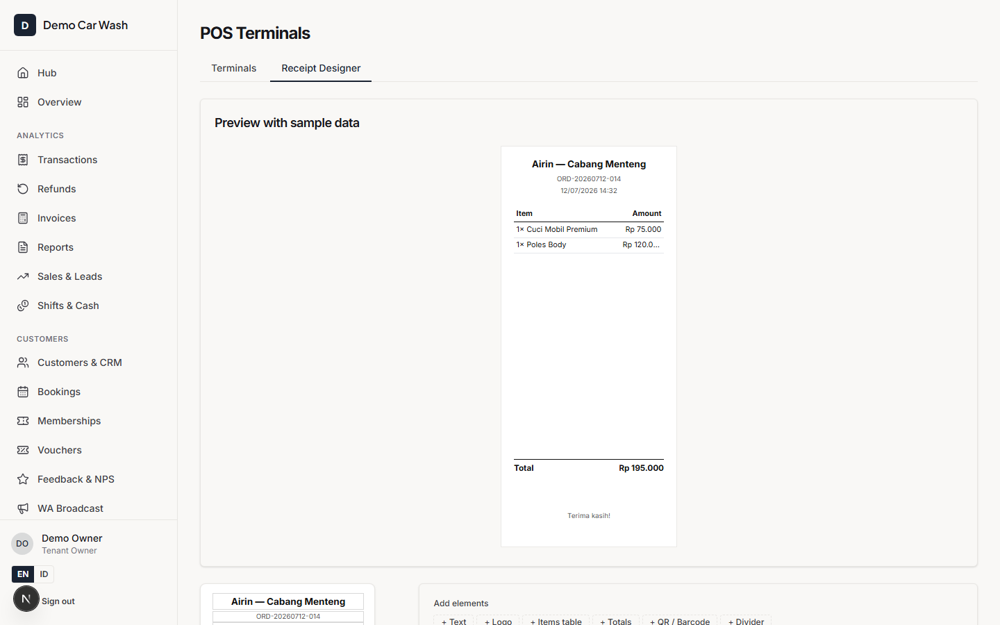
  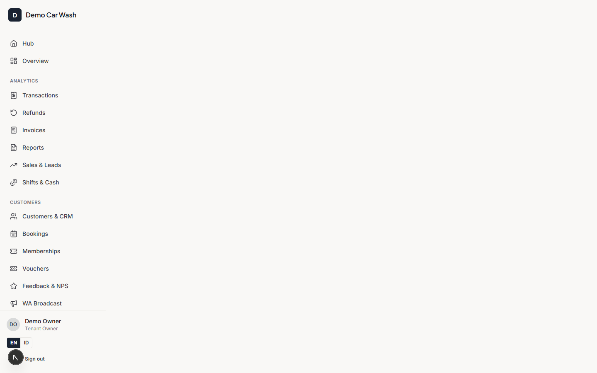

- **Devices / Topology / CCTV** (`/dashboard/devices`, `topology`, `cctv`) — the on-premise
  **branch-bridge** IoT and CCTV integration, if you use it. **Devices** lists the hardware the
  bridge discovered at a branch, **Topology** maps how they're wired, and **CCTV** streams live and
  recorded footage. (Setup detail is in the [Branch-Bridge](../tech/07-branch-bridge-protocol.md) and
  [Device Registry](../tech/08-device-registry-topology.md) technical notes.)

  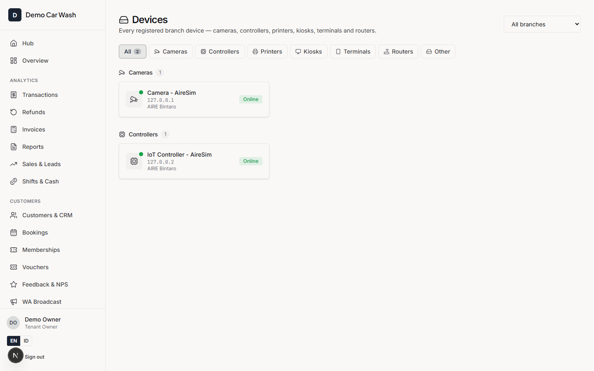
  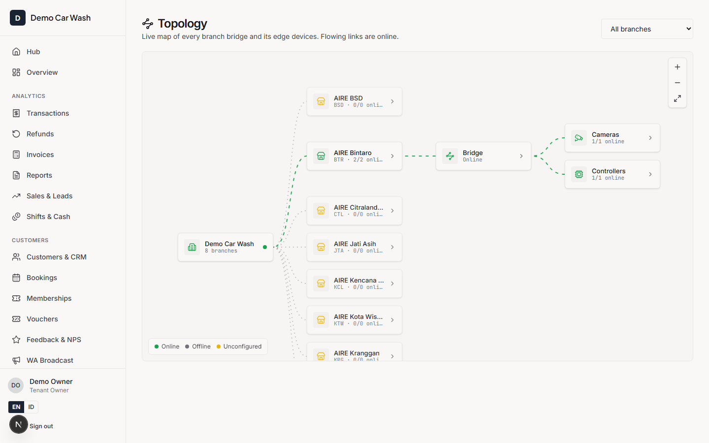
  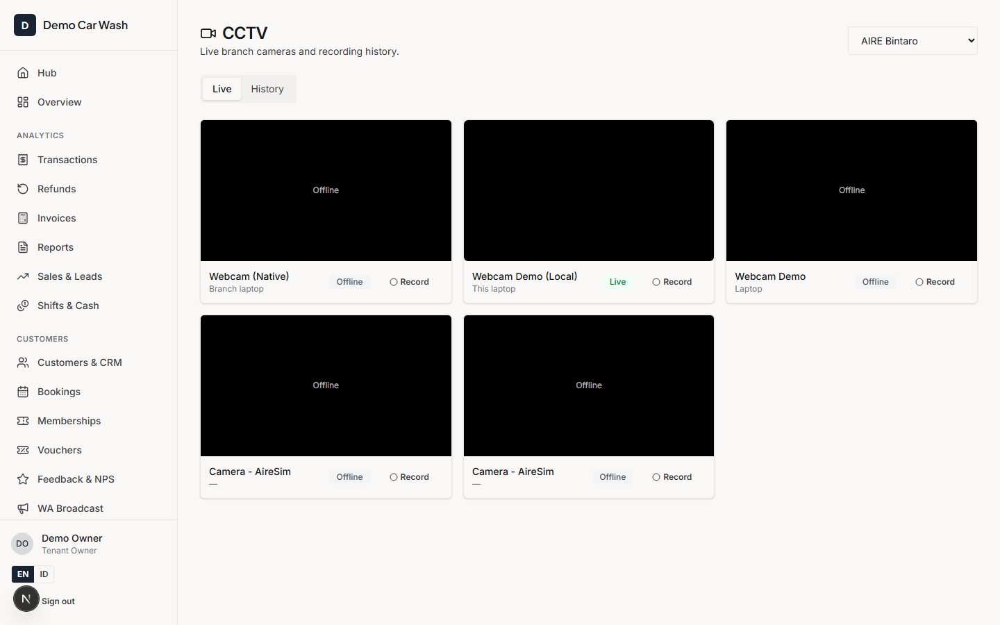

### 11.1 Barcodes (Settings → Barcodes)
**Sidebar → Barcodes** (`/dashboard/barcode-settings`). Turn on product barcodes to unlock
**scan-to-cart** at the POS and the label designer. On the **Settings** tab tick **Enable product
barcodes**, then choose a **symbology** (CODE128 / EAN-13 / QR) and options: **auto-generate** a
unique in-store barcode for new products, **scan adds to cart at POS**, and **print label on receive**.
A **Label Designer** tab appears once barcodes are enabled — design the printed label there.

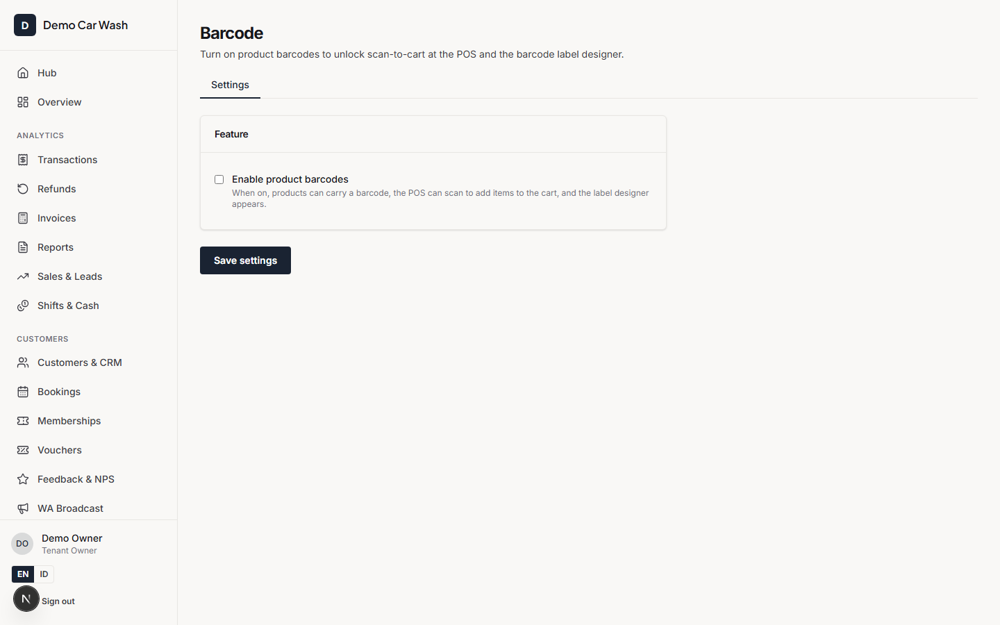

### 11.2 Feedback setup (Feedback & NPS → Setup)
**Sidebar → Feedback & NPS → Setup** (`/dashboard/feedback`). Tick **Enable customer feedback**, then
optionally **send automatically when an order is paid** (a WhatsApp link goes out after payment). Write
the **WhatsApp message**, set a **send delay** (0 = immediately) and how long the **link stays valid**
(1–90 days). Turn on **alerts** to be warned about low ratings (≤ a threshold you pick) or **NPS
detractors** (0–6). You can also build the **survey questions** — the star **rating** question is always
collected; you can add extra rating/NPS/text questions and toggle them on or off. (Results live on the
**Overview** tab — see §8.)

### 11.3 Audit log (Settings → Audit log)
**Sidebar → Audit log** (`/dashboard/audit`). A read-only record of every security-relevant change in
your business — order **voids**, cancellations, edits, shift openings — with **who, when, from which IP,
and the before/after values**. Filter by **operation** (e.g. `order.void`), **entity** (e.g. `order`)
and date range, and open any row to see the full before → after JSON. Use it to investigate a
disputed void or a "who changed this?" question.

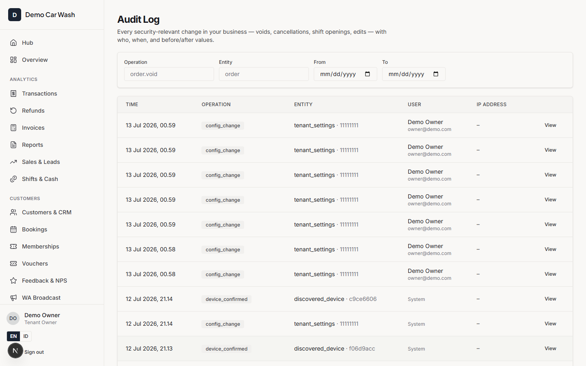

---

## 12. Tips & troubleshooting

- **A menu is missing?** That module was turned off by the platform administrator — the default is
  everything on. Ask them to enable it.
- **Two business units.** Tag every service correctly as **AIRE** (wash) or **LEAD** (detailing) —
  reports, payment channels and revenue split all rely on it.
- **Branch phone numbers** must be set (and WhatsApp connected) for portal bookings and
  expiry/notification messages to work.
- **WhatsApp features** need a **connected** WAHA/Kapso session (Agentic AI page).
- **Numbers look wrong?** Remember: **Finance** = revenue − expenses; **COGS** = revenue − cost of
  goods − expenses. Use COGS for true margin.
- **Member pricing not applying at the counter?** The membership may be in grace or expired — check
  the member's detail on **Memberships → Members**.
- **A broadcast is skipping most people?** By design it only messages **opted-in** customers — the
  "excluded (no consent)" count is normal. Don't force-include them unless you understand the ban risk.
- **The WhatsApp agent replies with generic text?** AI is on but no **API key** is set, or AI auto-reply
  is off — check **Agentic AI → AI model** (§10.2).
- **Tax invoice won't generate?** The order must be **paid/confirmed/completed**, and tax-invoice
  issuance must be **enabled** with your seller NPWP filled in (§7.9).
- **"Who voided this order?"** Open **Audit log** (§11.3) and filter operation `order.void`.

**Recommended setup order (first week):**
Branding → Branches → Catalog → Services → Payment methods → Payment gateway → Users & roles →
Vehicle catalog → Membership plans → (Inventory + Recipes if you track COGS) → Finance setup →
register POS terminals & kiosks → (optional) connect WhatsApp & AI, enable Feedback, Barcodes, Tax.

---

## 13. Glossary

| Term | What it means |
|------|---------------|
| **Tenant / tenant code** | Your business on the platform. Its permanent **6-character code** prefixes every membership number you issue and never changes. |
| **Business unit — AIRE / LEAD** | The tag on every service and order: **AIRE** = car wash, **LEAD** = detailing/coating. Reports and revenue split rely on it. |
| **Branch / outlet** | One physical location. Has a 3-letter code used on receipts and membership numbers. |
| **Module** | A whole feature area (Memberships, Finance, AI…) the platform can switch on/off for your business. |
| **Grace period** | The **14 days** after a membership's end date: still renewable, but **no member benefits** apply. |
| **Recipe** | What a service *consumes* (inventory items + cost lines). Drives COGS; the unit cost is frozen onto each order line at sale time. |
| **COGS vs Finance** | **Finance** = revenue − expenses. **COGS** = revenue − cost of goods − expenses (true margin). |
| **Settlement** | Money owed between branches when a member is served away from their home branch. |
| **Opname** | A physical stock count that reconciles the system to reality and records the variance. |
| **Faktur Pajak / e-Faktur / Coretax** | Indonesian VAT invoice (§7.9) and the government import format you export for filing. |
| **NPS** | Net Promoter Score — a −100…+100 loyalty measure from the feedback survey. |
| **WAHA / Kapso** | The two ways to connect a WhatsApp line for the AI agent. |
| **Simulation / mock mode** | Testing the WhatsApp flow with no real line — outgoing messages are captured, not sent. |
| **Persona** | An AI character (role + prompt) that governs how the customer agent talks and what it may do. |
| **Proposal** | An action the AI co-pilot wants to take, waiting for your approval (Overview → AI Action Proposals). |
| **Escalation number** | The supervisor's WhatsApp the agent hands a customer off to. |
