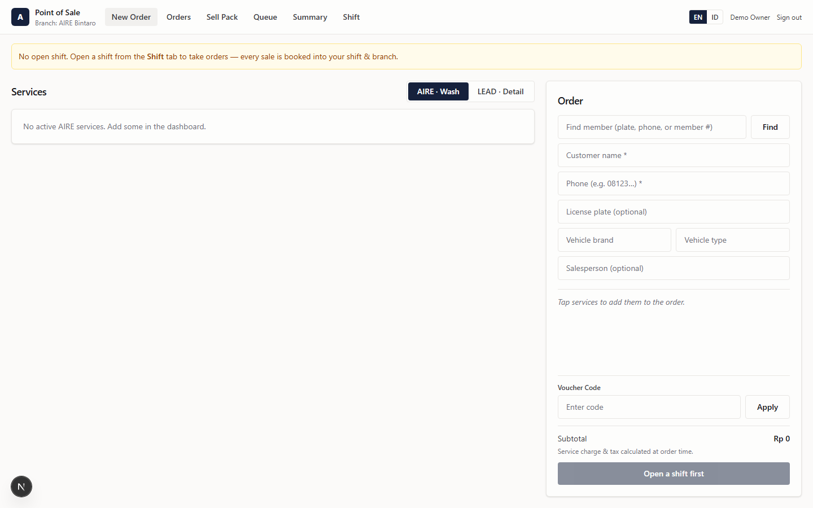
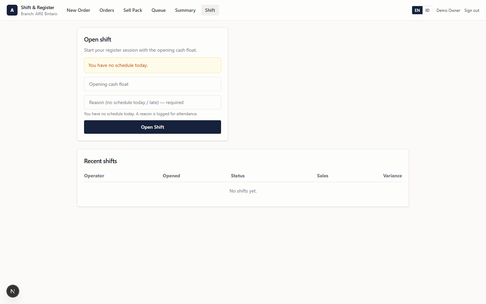
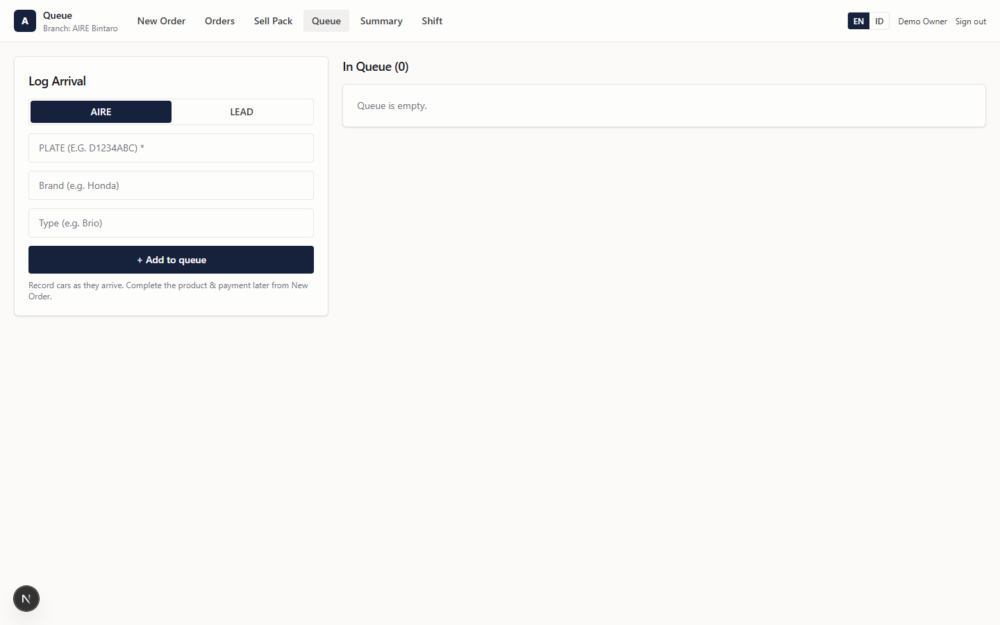
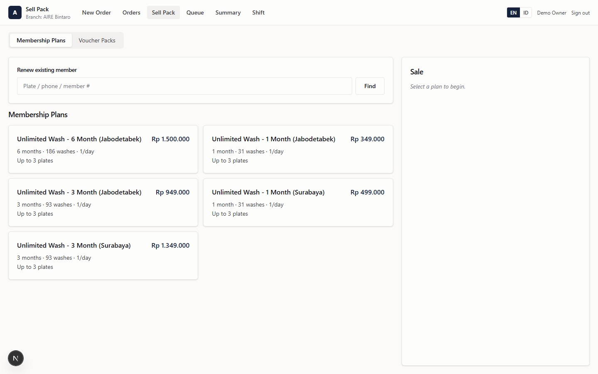
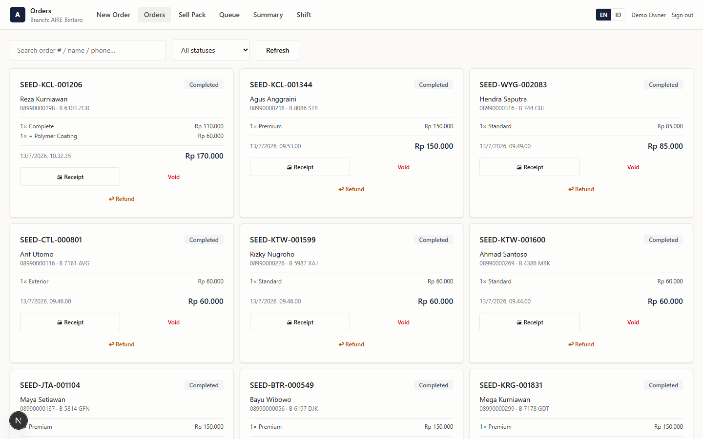
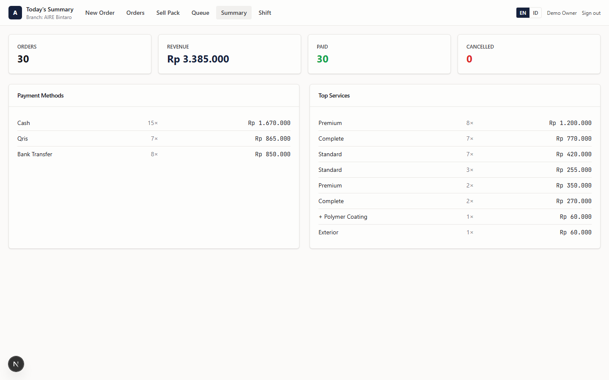

# Employee — User Manual (Cashier · Outlet Admin · HR)

**Who this is for:** you work at a branch. Depending on your role you run the **point of sale (POS)**,
the **arrival queue**, sell memberships and vouchers, manage stock, or handle HR & payroll.

- **Cashier** — POS, queue, shifts, selling memberships/vouchers.
- **Outlet Admin** — everything a cashier can do, **plus** edit/void orders, suspend/reactivate
  memberships, branch inventory / procurement / opname, and branch reports.
- **HR staff** — the HR and payroll pages.

> **Language:** use the **EN / ID** toggle (top-right of the POS, bottom-left of the Dashboard) to
> switch English ↔ Indonesian at any time.

---

## Table of contents

1. [Sign in & open the POS](#1-sign-in--open-the-pos)
2. [Start your day: open a shift](#2-start-your-day-open-a-shift)
3. [The POS at a glance](#3-the-pos-at-a-glance)
4. [Take a sale (New Order)](#4-take-a-sale-new-order)
5. [The arrival queue](#5-the-arrival-queue)
6. [Sell Pack — memberships & voucher packs](#6-sell-pack--memberships--voucher-packs)
7. [Orders & the day summary](#7-orders--the-day-summary)
8. [Close your shift](#8-close-your-shift)
9. [Inventory & stock (Outlet Admin)](#9-inventory--stock-outlet-admin)
10. [HR & payroll (HR staff)](#10-hr--payroll-hr-staff)
11. [Your own self-service page (every employee)](#11-your-own-self-service-page)
12. [Quick reference](#12-quick-reference)

---

## 1. Sign in & open the POS

The POS runs on a **registered terminal** (a specific tablet or PC). There are two one-time and
everyday steps:

**A. Register the terminal (once per device).** The first time a device opens the POS it shows
*"This terminal is not registered."* Your owner/outlet admin gets the **launch URL** from
**Dashboard → POS Terminals** and opens it on this device (or pastes it into the box). After that,
the device stays registered and remembers its branch.

**B. Sign in (every shift).** On a registered terminal, sign in with **your own email + password**
(cashiers can also use the **Employee · Cashier** demo card on a demo system). Signing in with your
own account is what attributes orders and shifts to **you**.

Once you're in, the POS opens on its tabs. The branch you're working at is shown at the top-left
(e.g. *"Branch: AIRE Bintaro"*).

---

## 2. Start your day: open a shift

**You must have an open shift before you can take any orders.** Every sale is booked into your shift,
and the shift fixes the branch — so end-of-day cash always reconciles to the right place.

1. Go to the **Shift** tab.
2. In **Open shift**, enter the **opening cash float** (the cash already in the drawer).
3. If you're not on today's schedule (or scheduled at another branch), a **Reason** field appears —
   it's required, and it's logged for attendance.
4. Click **Open Shift**.

While the shift is open, everything you sell belongs to it.

---

## 3. The POS at a glance

Across the top of the POS are six tabs:

**New Order · Orders · Sell Pack · Queue · Summary · Shift**

- **New Order** — ring up a sale.
- **Orders** — browse/search today's orders.
- **Sell Pack** — sell or renew memberships, and sell voucher packs.
- **Queue** — the arrival board (cars waiting).
- **Summary** — today's totals.
- **Shift** — open/close the register.

---

## 4. Take a sale (New Order)

1. Pick the **business unit** at the top of the service grid — **AIRE · Wash** or **LEAD · Detail**.
   The grid filters, but both share **one cart and one receipt**.
2. **Tap services** to add them to the cart (right-hand **Order** panel).
3. Enter the customer's **name** and **phone**, and the vehicle **plate / brand / type** (the
   brand → type dropdowns help).
4. **Find member** *(optional)* — type a plate, phone, or 12-character membership number in the
   **Find member** box (or scan the card) and click **Find**:
   - If they're an **active** member, member pricing applies automatically and their card can show.
   - If their membership is **expiring soon, in grace, revoked, or suspended**, you'll see an alert
     with a **"Go to Sell Pack"** button to renew. Grace/revoked members get **no** benefits until
     renewed.
5. **Voucher code** *(optional)* — type a code and click **Apply**; valid ones appear as removable
   chips.
6. Click **Place Order** (the button reads **"Open a shift first"** until you've opened a shift —
   see §2), then take payment:
   - **Cash** — enter the amount received; the change to give is shown.
   - **QRIS (dynamic)** — a QR appears; the screen waits and **confirms automatically** once the
     customer pays.
   - **EDC / card / transfer** — record the method.
7. A receipt appears — start the next order.

> **Order from the queue.** If a car is already on the arrival board, use **Order from Queue** (or the
> Queue tab's **Proses Bayar**): the order prefills the plate/vehicle and, for members, the
> name/phone — you just take payment. Think of it like picking a table in a restaurant and printing
> the check.

---

## 5. The arrival queue

**Queue tab.** The queue is your branch's operational board. Two things are tracked **separately**:

- **Service status:** waiting → serving → done.
- **Payment status:** paid / unpaid (a badge, derived from the order — you never set it by hand).

**Typical flow:**

1. A car arrives → in **Log Arrival**, pick **AIRE** or **LEAD**, enter the **plate** (and optional
   brand/type), and click **+ Add to queue**. No order is created yet.
2. When it's their turn, select the car and choose **Proses Bayar** → the New Order screen prefills →
   take payment.
3. When the wash is finished, mark the car **Done**.

> ⚠️ **You cannot mark a car "Done" until its order is paid.** Collect payment first.

The public **Queue Board** (`/queue-board/...`) is a full-screen TV display of this same queue for
the waiting area.

---

## 6. Sell Pack — memberships & voucher packs

**Sell Pack tab.** Two sub-tabs: **Membership Plans** and **Voucher Packs**.

### Sell a new membership
1. On **Membership Plans**, click a plan → this creates a **fee order** → take payment.
2. **Register the customer's vehicle plate(s)** (up to the plan's limit) → click **Activate**.
3. The membership is now active; the member number is issued and a WhatsApp welcome may be sent.

### Renew an existing member
1. At the top of the same tab, use **Renew existing member** — **Find** them by plate/phone/number.
2. Pick their membership → **Renew** → take payment.
3. The renewal takes effect **only after** the fee is paid (this is automatic). **Active/grace**
   members are **extended**; **revoked** members get a **new** membership.

### Sell a voucher pack
1. On **Voucher Packs**, pick a pack template → take payment.
2. The codes are generated and **sent to the buyer over WhatsApp** automatically.

---

## 7. Orders & the day summary

- **Orders tab** — browse and search today's orders by status. Outlet Admins can **edit** customer
  details or **void** an order (only while the shift is open).

  

- **Summary tab** — today's totals for your branch/shift at a glance.

  

---

## 8. Close your shift

At the end of your shift, go to **Shift → Close shift**:

1. Count the cash drawer and enter the **counted amount**.
2. The system shows the **expected** amount (opening float + cash sales + petty-in − petty-out) and
   the **variance**.
3. Log any **petty cash** movements or **shift issues** before closing.
4. Confirm to close.

> Once a shift is closed, its orders are **locked** for the day — no more edits or voids.

---

## 9. Inventory & stock (Outlet Admin)

These live in the **Dashboard** (not the POS):

- **Inventory** (`/dashboard/inventory`) — view stock, add items, **adjust** in/out.
- **Procurement** (`/dashboard/procurement`) — create purchase orders and **Receive** them (which
  restocks automatically).
- **Stock Opname** (`/dashboard/opname`) — start a count → enter the physical counts → **Close** to
  reconcile the system to reality and record any variance.

> A sale at the POS is **never blocked** by low stock — you can always ring it up. But the **kiosk**
> and public **eMenu** hide out-of-stock products from customers.

---

## 10. HR & payroll (HR staff)

- **HR** (`/dashboard/hr`) — manage employees, **clock in/out**, schedules, leave requests
  (approve/reject), and holidays. You can **link** an employee record to their login account.
- **Payroll** (`/dashboard/payroll`) — add bonuses / deductions / advances / loans, **generate** a
  payroll run for the month, review payslips, **Finalize** to lock it, and **export** payslips as
  CSV.

(Screenshots and detail are in the [Tenant Owner manual §9](02-tenant-owner-manual.md).)

---

## 11. Your own self-service page

Every employee — not just HR — has a personal self-service page at **`/employee`**. Sign in with your
own account and open it from the Hub. It's *your* information only; you can't see anyone else's.

Across the top are tabs:

- **Home** — today at a glance: your **shift**, whether you've **clocked in/out**, and hours worked.
- **Schedule** — your upcoming shifts (date, times, branch).
- **Attendance** — your clock-in/out history and hours per day.
- **Payslips** — each finalized payslip, with the full breakdown (base salary, days worked, bonuses,
  deductions, advances, loan repayments, unpaid-leave deduction, and **net pay**).
- **Leave** — request time off (start/end dates, type, reason) and see whether each request is
  **pending / approved / rejected**, and whether it's paid.
- **Loans** — any staff loan or advance you've been given: the principal, remaining balance, monthly
  installment, and the repayments already taken from your pay.
- **Profile** — your own details (role, branch, employment type, contact info).

> **Cashier vs. self-service.** The **POS** is where you *work* (sell, queue, shifts). This
> **`/employee`** page is where you check *your own* schedule, attendance and pay. Two different
> screens, both signed in as you.

---

## 12. Quick reference

| I want to… | Go to |
|------------|-------|
| Open / close the register | POS → **Shift** |
| Take a sale | POS → **New Order** |
| Take payment for a queued car | POS → **Queue** → **Proses Bayar** |
| Add a walk-in to the queue | POS → **Queue** → **Log Arrival → + Add to queue** |
| Find a member's details/pricing | POS → **New Order** → **Find member** |
| Sell or renew a membership | POS → **Sell Pack → Membership Plans** |
| Sell a voucher pack | POS → **Sell Pack → Voucher Packs** |
| See today's totals | POS → **Summary** |
| Edit or void an order (Outlet Admin) | POS → **Orders** |
| Receive stock (Outlet Admin) | Dashboard → **Procurement** |
| Count stock (Outlet Admin) | Dashboard → **Stock Opname** |

> **Remember the two golden rules:** (1) **open a shift before selling**, and (2) **a car can't be
> "Done" until its order is paid.**
