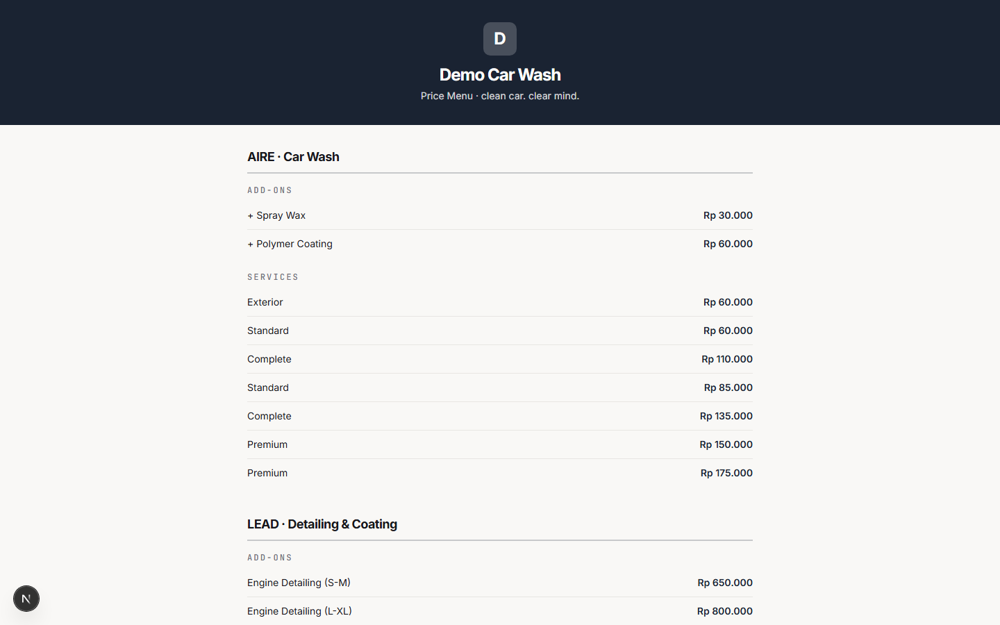
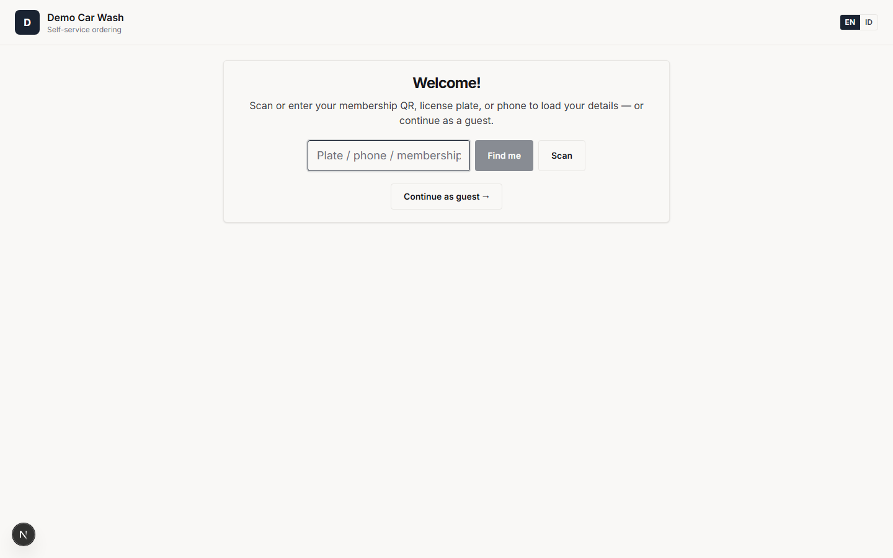
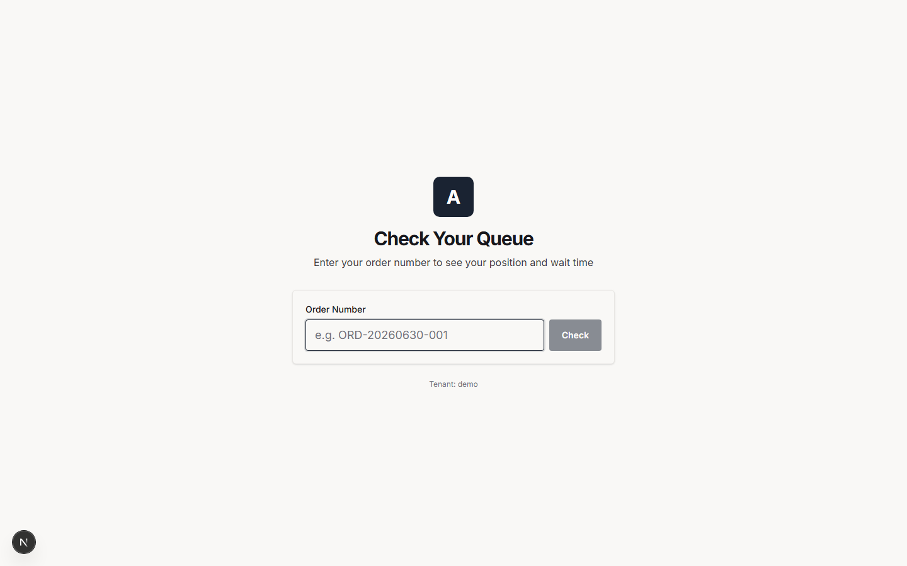
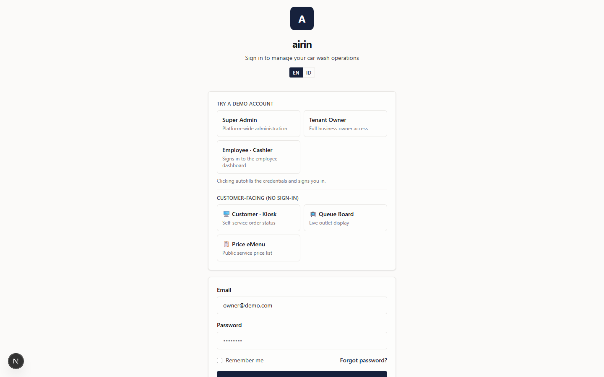
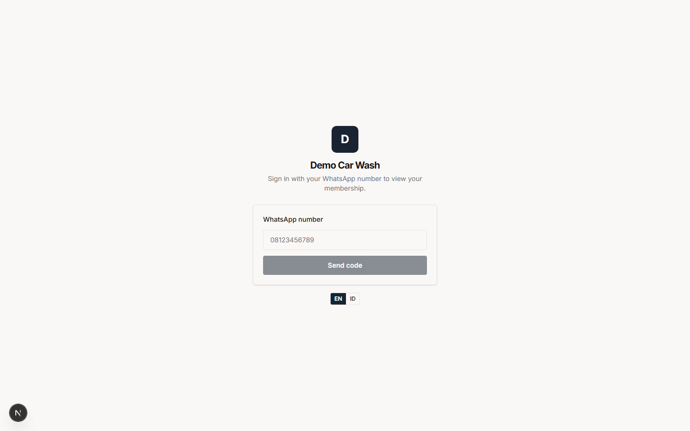

# Customer — User Manual

Welcome! You're a customer of a car-wash / detailing business that runs on **airin**. You don't need
to install an app or remember a password to use most of it — everything below opens in a normal web
browser, usually from a **link or QR code** the business shares (on a poster, receipt, or WhatsApp).

To see your **membership**, you sign in with a **one-time code** sent to your WhatsApp — no password
to remember.

Everything is branded to the business you're visiting and available in **English or Indonesian**
(look for the **EN / ID** toggle).

---

## Table of contents

1. [Browse the price menu (no sign-in)](#1-browse-the-price-menu-no-sign-in)
2. [Order at the self-service kiosk](#2-order-at-the-self-service-kiosk)
3. [Check where your car is in line](#3-check-where-your-car-is-in-line)
4. [Your member portal](#4-your-member-portal)
5. [Book an appointment](#5-book-an-appointment)
6. [Understanding your membership](#6-understanding-your-membership)
7. [Chat with the business on WhatsApp](#7-chat-with-the-business-on-whatsapp)
8. [Troubleshooting](#8-troubleshooting)

---

## 1. Browse the price menu (no sign-in)

Open the business's **eMenu** link (it looks like `/menu/...`). You'll see all their services and
prices, split into **AIRE · Car Wash** and **LEAD · Detailing & Coating**, plus any add-ons. It's
just a price list — nothing to sign in for.

---

## 2. Order at the self-service kiosk

At the branch there may be a **kiosk tablet** (or a QR code that opens the ordering screen). You can
book your own wash without waiting for a cashier:

**Step by step:**

1. **Identify yourself (optional).** Type your **plate, phone, or membership number**, or tap
   **Scan** to scan your membership QR, then tap **Find me**. If you're an active member, your member
   pricing is applied and your card can show. Or just tap **Continue as guest →**.
2. **Choose your services.** Out-of-stock items appear greyed out.
3. **Enter your details** — name, phone, plate, and vehicle.
4. **Pay:**
   - **Pay now (QRIS)** — scan the QR with your banking or e-wallet app; the screen confirms once
     you've paid.
   - **Pay at cashier** — your car is added to the queue and you settle at the counter.
5. **Done** — your car is on the queue.

---

## 3. Check where your car is in line

Two ways to see your position:

- **Queue status lookup** — open the queue-check link (`/kiosk/...`), enter your **order number**,
  and tap **Check** to see your position and estimated wait.

  

- **Queue board** — the in-store TV screen shows the live queue for everyone in the waiting area.

  

---

## 4. Your member portal

If you're a **member**, the portal is your home base. Open the portal link for the business
(`/portal/...`).

### Signing in (WhatsApp one-time code)

1. Enter the **WhatsApp number** registered with your membership.
2. Tap **Send code**. You'll receive a **6-digit code** on WhatsApp (valid for 5 minutes). Enter it.
3. You're signed in for about 2 hours. *(For security, wrong codes are limited and you can only
   request a new code after a short wait. Your WhatsApp number **is** your login — there's no
   password.)*

### What you can see and do

- **Home** — your membership status, plan, valid-until date, and usage. If your membership is in its
  grace window or has lapsed, you'll see a prompt to **renew**.
- **Card** — your digital membership card with your number and QR code.
- **Vouchers** — vouchers you own (active / used).
- **Vehicles** — the plates registered to your membership.
- **Menu** — the business's services, prices, and plans.
- **History** — your past visits and orders.
- **Queue** — the live queue for a branch you choose; your own car is highlighted.
- **Renew** — pick a plan and pay by **QRIS**; your membership updates automatically once paid.
- **Book** — request an appointment (see §5).

---

## 5. Book an appointment

From the member portal, tap **Book** and choose a **branch, service, date/time, and your vehicle**.
The branch confirms via WhatsApp; once confirmed, your car is placed on the queue for that time.
You'll get a WhatsApp message when it's **confirmed** (or if it's declined).

---

## 6. Understanding your membership

- While your membership is **active**, you get your plan's free/discounted washes **automatically** —
  just identify yourself (plate, phone, number, or card scan) at the counter or kiosk.
- After your end date, there's a **14-day grace period**: you can still **renew** (which extends your
  membership), but you **don't get member benefits during grace**.
- After the grace period, the membership closes and you'd buy a **new** one. Your member number and
  history stay with you.
- **Renewing always takes payment first**, and your membership is extended the moment the payment
  confirms. Renew at the counter, or yourself in the portal with **QRIS**.

---

## 7. Chat with the business on WhatsApp

Many businesses let you chat with them on **WhatsApp**. An assistant can answer about **your own**
membership status, orders, queue position, vouchers, and bookings — plus general info like prices and
opening hours.

It only ever sees **your** information (never other customers' details) and will hand you over to a
real person whenever you ask, or when it can't help.

---

## 8. Troubleshooting

- **No code arrived?** Make sure you entered the WhatsApp number **registered with your membership**,
  wait a few seconds, and check WhatsApp. If it still doesn't arrive, the business's WhatsApp may not
  be connected — ask them at the counter.
- **Member pricing didn't apply?** Your membership may be expired or in grace. Check the portal
  **Home** tab and renew if prompted.
- **QR payment didn't confirm?** Give it a moment. If it still shows unpaid, ask a cashier — they can
  complete the payment at the counter.
- **Kiosk says "not configured"?** That tablet hasn't been set up yet — ask a staff member.
